发布 Android 应用商店
===

APP上架安卓商店需准备各平台所需版权证明 `计算机软件著作权登记证书（软件著作权）` 、`互联网信息服务安全承诺书` 等。

## 一. 腾讯应用宝

### 1.注册开发者账号

进入[腾讯开放平台](https://open.tencent.com/),找到 `应用开放平台` 点击 `管理中心` 进入登录/注册页面，选择 `注册注册新账号`。

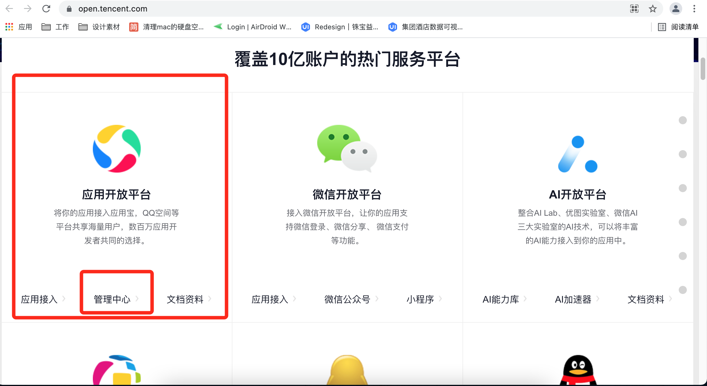<!--rehype:style=max-width: 650px;width: 100%;-->  

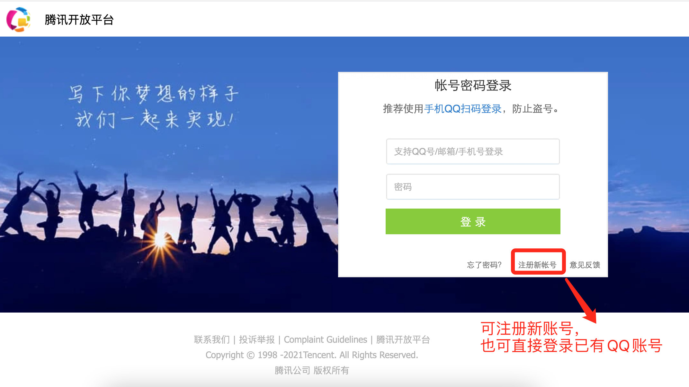<!--rehype:style=max-width: 650px;width: 100%;-->  

### `选择注册类型`<!--rehype:style=color: white; background: #1c7bd0;-->

开发者账号登录成功后，跳转至注册资质页面，可选择注册 `公司或个人`。

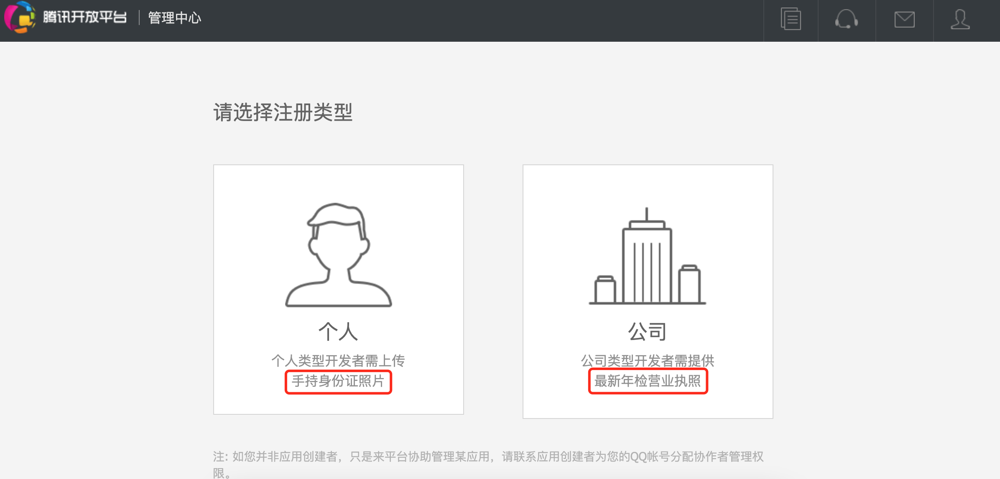<!--rehype:style=max-width: 650px;width: 100%;-->  

### `注册公司资质`<!--rehype:style=color: white; background: #1c7bd0;-->

进入资料填写页面，根据提示填写 `公司全称` 、 `统一社会信用代码` 、 `营业执照照片` 等相关资料。

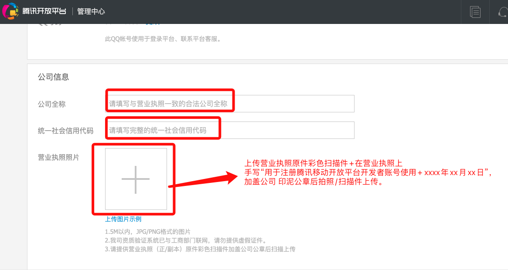<!--rehype:style=max-width: 650px;width: 100%;-->

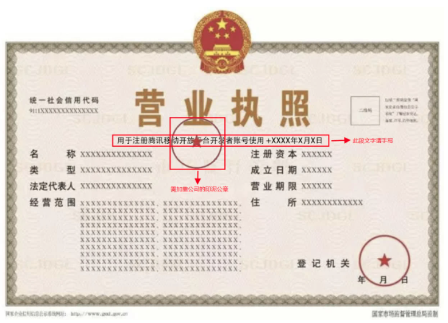<!--rehype:style=max-width: 650px;width: 100%;-->

> ⚠️ 注意事项:
> 1. 营业执照必须为 `彩色原件照`<!--rehype:style=background: #F08800; color: #fff;-->。
> 2. 营业照片可上传 `5M以内`<!--rehype:style=background: #F08800; color: #fff;-->图片。
> 3. 需手写 `“用于注册腾讯移动开放平台开发者账号使用 +日期”`<!--rehype:style=background: #F08800; color: #fff;-->，并在上面 `加盖公司印章`<!--rehype:style=background: #F08800; color: #fff;-->。
> 4. 一个公司资质只能注册一个开发者账号，不得重复注册使用。
<!--rehype:style=border-left: 8px solid #ffe564;background-color: #ffe56440;padding: 12px 16px;-->

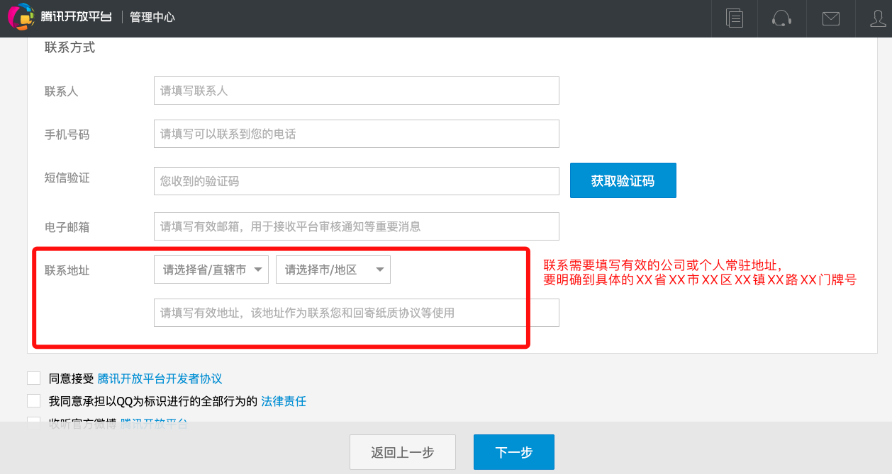<!--rehype:style=max-width: 650px;width: 100%;-->

> ⚠️ 注意：联系地址需要填写有效的公司或个人常驻地址，要明确到具体的XXX省XXX市XXX区XXX镇XXX路XXX门牌号。
<!--rehype:style=border-left: 8px solid #ffe564;background-color: #ffe56440;padding: 12px 16px;-->

### `验证邮箱 `<!--rehype:style=color: white; background: #1c7bd0;-->

公司或个人信息填写完成后点击下一步开始验证邮箱，点击 `立即验证` 后,登录邮箱点击邮件中的链接进行验证，验证成功后出现成功提示 ，即标识资料填写完成。

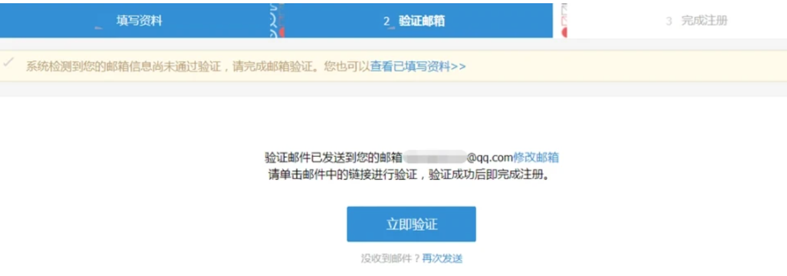<!--rehype:style=max-width: 650px;width: 100%;-->

---
### 2.创建应用

开发者账号注册成功后，即可进入 `管理中心` ，找到 `创建应用` 进行创建。 

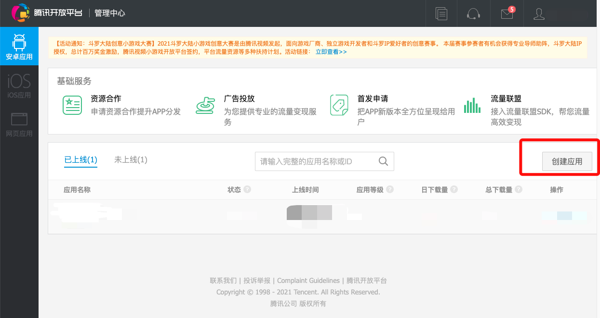<!--rehype:style=max-width: 650px;width: 100%;-->

### `选择平台`<!--rehype:style=color: white; background: #1c7bd0;-->

根据应用类型选择要发布的平台，应用创建成功后，即可进入发布页面。

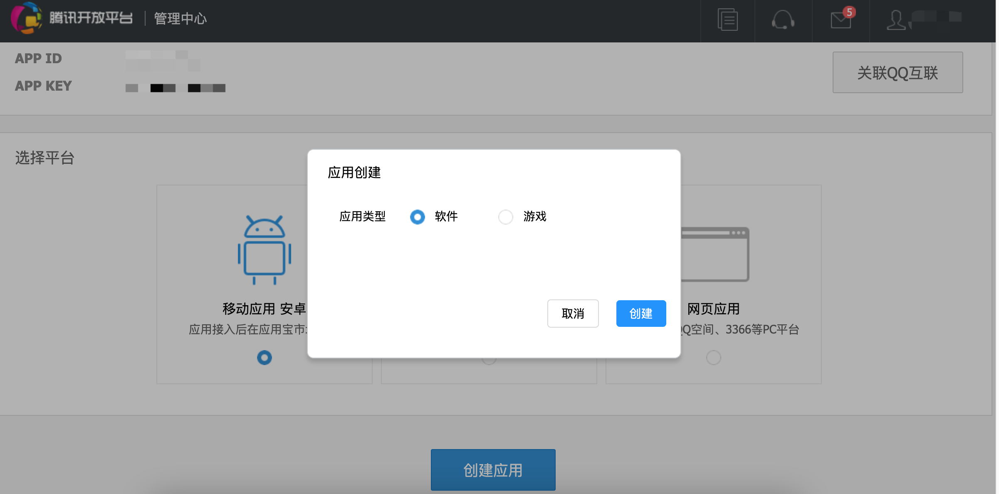<!--rehype:style=max-width: 650px;width: 100%;-->

### `基本信息`<!--rehype:style=color: white; background: #1c7bd0;-->

根据提示要求填写应用基本信息。

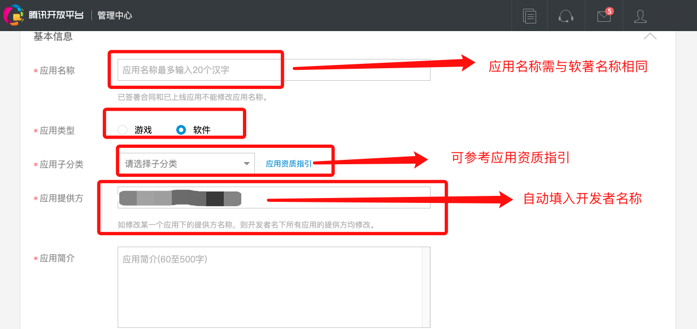<!--rehype:style=max-width: 650px;width: 100%;-->

> ⚠️ 注意：`应用名称`<!--rehype:style=background: #F08800; color: #fff;--> 需要与 `软著名称`<!--rehype:style=background: #F08800; color: #fff;--> 相同。
<!--rehype:style=border-left: 8px solid #ffe564;background-color: #ffe56440;padding: 12px 16px;-->

### `安装包`<!--rehype:style=color: white; background: #1c7bd0;-->

上传打包好的项目APK文件，及填写相关登录账号信息，发布类型可选择 `审核通过后立即发布` 或 `定时发布`。

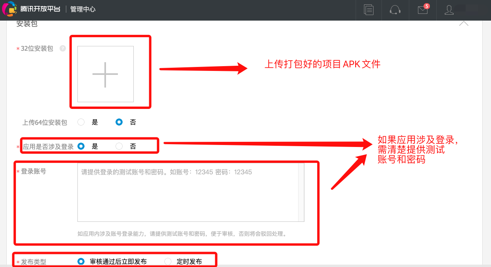<!--rehype:style=max-width: 650px;width: 100%;-->

> ⚠️ 注意：如账号涉及登录，需提供 `测试账号及密码`<!--rehype:style=background: #F08800; color: #fff;-->。
<!--rehype:style=border-left: 8px solid #ffe564;background-color: #ffe56440;padding: 12px 16px;-->

### `图标素材`<!--rehype:style=color: white; background: #1c7bd0;-->

根据提示上传 `应用图标` 及 `应用截图` 。

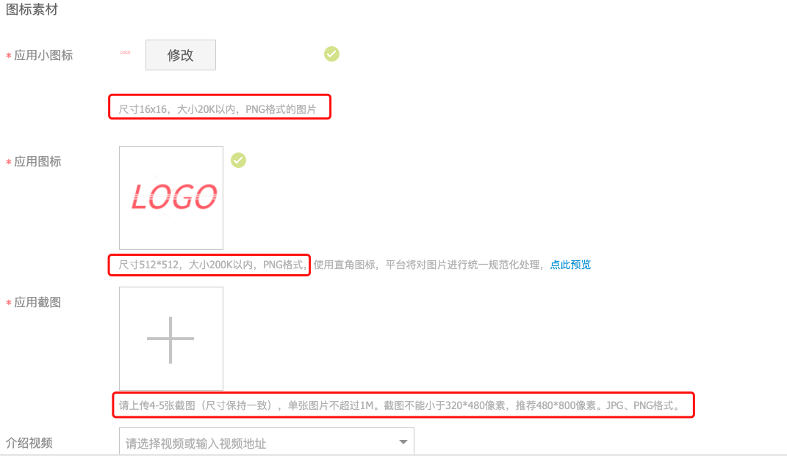<!--rehype:style=max-width: 650px;width: 100%;-->

> ⚠️ 注意事项:
> 1. 注意图片的 `尺寸` 、 `大小` 、 `格式` 根据提示上传。
> 2. 为更快通过审核图片内容需与APP实际内容相符，且图片同时于 `APP Store应用图片预览` 使用。
<!--rehype:style=border-left: 8px solid #ffe564;background-color: #ffe56440;padding: 12px 16px;-->

### `适配信息`<!--rehype:style=color: white; background: #1c7bd0;-->

根据项目情况填写适配信息。

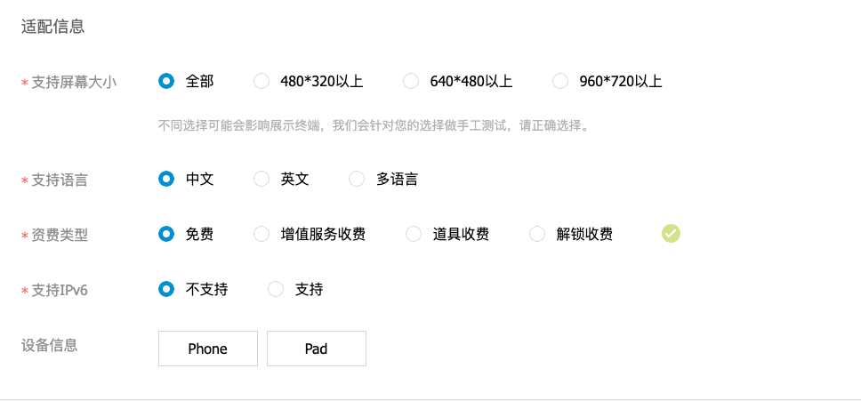<!--rehype:style=max-width: 650px;width: 100%;-->
### `版权证明`<!--rehype:style=color: white; background: #1c7bd0;-->

上传 `软著版权证明`及 填写 `研发公司名称`。

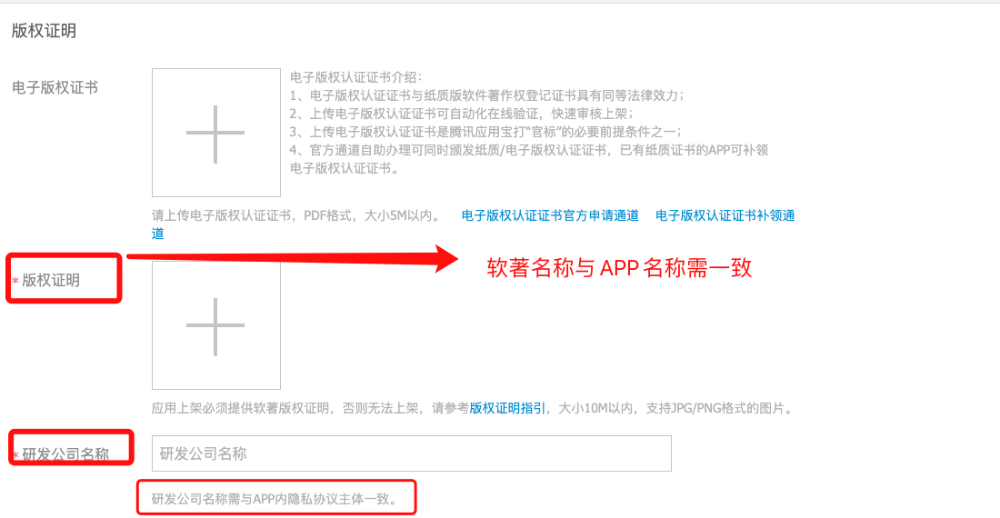<!--rehype:style=max-width: 650px;width: 100%;-->

> ⚠️ 注意： `软著版权证明`<!--rehype:style=background: #F08800; color: #fff;--> 中应用名称需与APP名称一致， `研发公司名称`<!--rehype:style=background: #F08800; color: #fff;--> 名称需与APP内隐私协议主体一致。
<!--rehype:style=border-left: 8px solid #ffe564;background-color: #ffe56440;padding: 12px 16px;-->
### `隐私权限`<!--rehype:style=color: white; background: #1c7bd0;-->

根据截图示例，上传隐私政策相关截图信息。

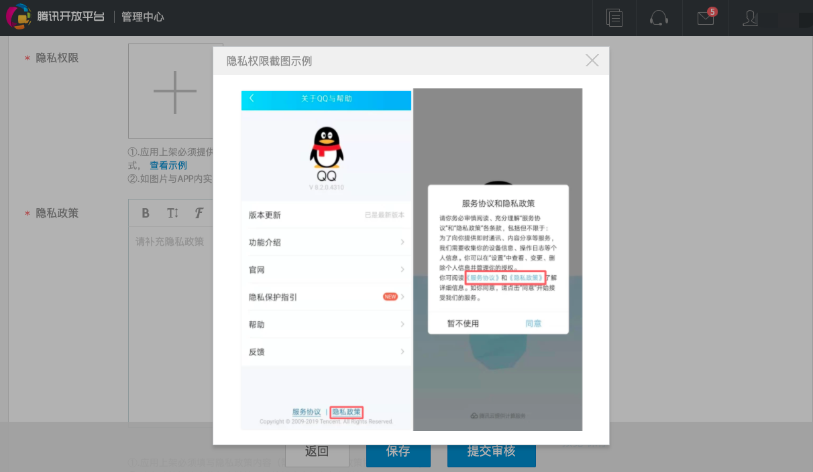<!--rehype:style=max-width: 650px;width: 100%;-->

> ⚠️ 注意：上传的隐私权限截图展示中，必须提供 `需包含首页弹窗+常驻入口页面`<!--rehype:style=background: #F08800; color: #fff;-->。
<!--rehype:style=border-left: 8px solid #ffe564;background-color: #ffe56440;padding: 12px 16px;-->

### `提交审核`<!--rehype:style=color: white; background: #1c7bd0;-->

相关信息填写完成后，即可提交以供审核。 

> 🚧  审核通过后，若版本发布为自动发布，APP将自动发布成功，若审核不通过，可查看审核驳回原因，或咨询腾讯人工客服，根据审批要求进行相关整改。
<!--rehype:style=border-left: 8px solid #ffe564;background-color: #ffe56440;padding: 12px 16px;-->