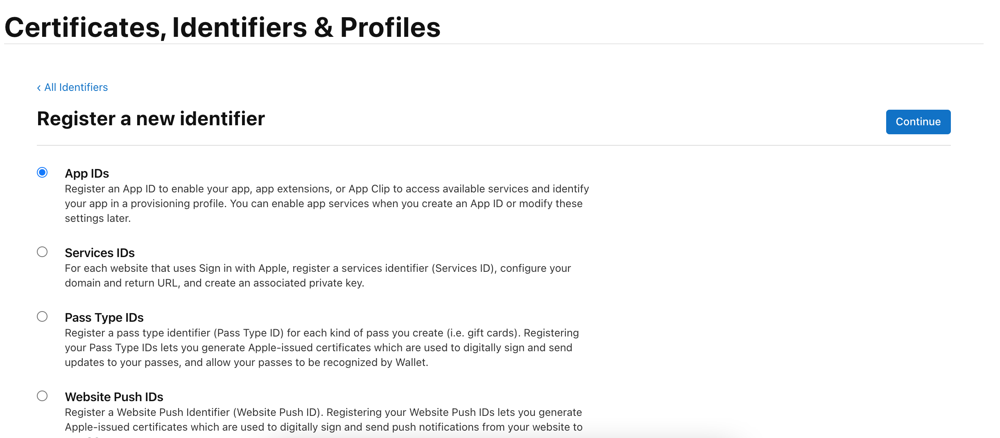

发布 iOS 应用商店
---

APP上架前需注册开发者账号，创建 **`证书请求文件（CSR文件）`** 、 **`发布证书 （CER）`** 及 **`Provisioning Profiles配置文件 （PP文件）`** ,创建完成后，即可准备将已完成的项目进行提交上架。

## 一. 创建AppID

### `注册开发者账号`
进入[Developer苹果开发者官网](https://developer.apple.com),点击“Account”登录/注册会员。

  

### `创建 AppID`
登陆成功后，选择 **`Certificates, Identifiers & Profiles`** 进入页面点击  **`Identifiers`**，填写信息创建AppID。

  

### `App IDs`
选择App IDs点击Continue进入下一步，选择APP继续填写信息。

  

### `填写 Description 及 Bundle ID`

---

## 二. 创建ProvisioningProfiles文件

### `App IDs`
进入Certificates, Identifiers & Profiles页面，找到 **`Profiles`** ，点击 + 号，选择App Store，点击Continue进入下一步。

### `App IDs（Bundle ID）`
在选项栏中找到刚刚创建的App IDs（Bundle ID）类型套装，选择发布证书，点击Continue进入下一步

### `生成并下载PP文件`
在 `Provisioning Profile Name` 栏中填入文件名,点击Generate进入下一步，再点击Download下载生成的文件

