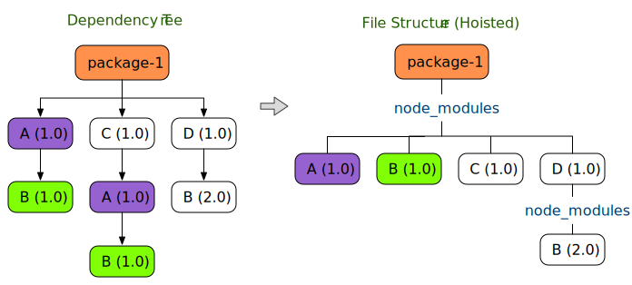
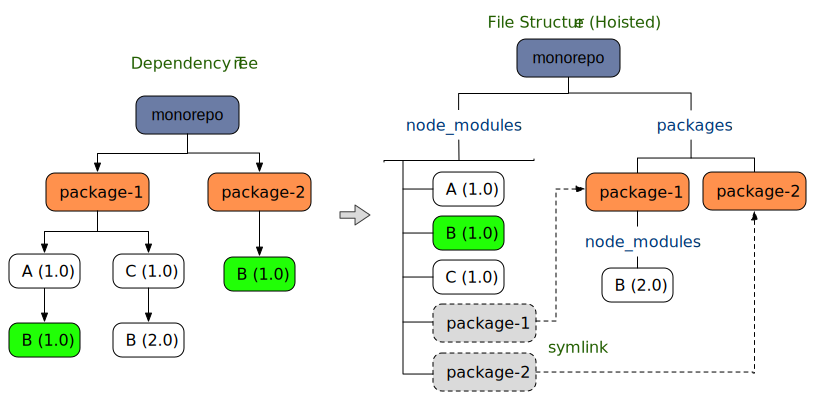

参与组件开发
===

当前 [`react-native-uiw`](https://github.com/uiwjs/react-native-uiw) 项目工程，使用 [Yarn](https://classic.yarnpkg.com/lang/en/) & [lerna](https://github.com/lerna/lerna)  构建 `monorepo`，整个里面包含 `example` 示例、`packages` 组件包、`website` 文档网站。

> 🚧 `注意事项:示例依赖不可随意更新`<!--rehype:style=background: #da0000; color: #fff;-->
> 1. 🪲 添加新依赖包，需要配置 [nohoist](https://github.com/uiwjs/react-native-uiw/blob/46f73cf7ca5404184df7fa996a33f821d45cf0e7/package.json#L62-L80)，以解决子包依赖不存在的问题。
> 2. 📦 如果依赖本地包，React Native 示例需要更改 [metro](https://github.com/facebook/metro) 配置 [metro.config.js](https://github.com/uiwjs/react-native-uiw/blob/9a300184608c71615167c517433bb9aed606f0ec/example/examples/metro.config.js#L12)
> 3. 🐛Pod 版本请根据项目安装，可以在 `ios/Podfile`<!--rehype:style=color: #e00000;--> 中确定使用那个版本的 `pod`
> 4. ✅ 组件仅支持 `react-native@0.60+`<!--rehype:style=color: #e00000;--> 以上的版本。
> 5. ⛳️ [React Navigation 6](https://github.com/react-navigation/react-navigation) 至少需要 [react-native@0.63.0](https://github.com/facebook/react-native)。 如果您使用的是 Expo，则您的 SDK 版本需要至少为 41。 
<!--rehype:style=border-left: 8px solid #ffe564;background-color: #ffe56440;padding: 12px 16px;-->

## 目录结构

```bash
├── README.md -> packages/core/README.md
├── example
│   ├── base     # 🐝 用于单个组件实例测试
│   │   ├── ....
│   │   ├── lib  # 🔄 解决预览组件生成的临时目录
│   │   └── metro.config.js
│   └── examples # 🐝 所有组件实例
│       ├── ....
│       ├── lib  # 🔄 解决预览组件生成的临时目录
│       └── metro.config.js
├── lerna.json
├── package.json
└── packages
    ├── core    # 📦 @uiw/react-native 组件源码
    │   ├── lib # 🔄 剔除类型的源码输出目录
    │   ├── src
    │   │   ├── Avatar
    │   │   ├── ....
    │   │   └── index.tsx
    │   └── tsconfig.json
    └── docs    # 📦 @uiw/react-native-doc 可忽略，编译后的组件文档静态文件提交到 npm 提供文档版本预览
```

## 启动项 APP 预览示例

我们通过几个步骤，帮助您启动项目中的组件示例 `example/examples`<!--rehype:style=color: #039423; background: #e3efe7;--> APP 应用实例。

### `第 1 步`<!--rehype:style=background: #a5d4ff;--> 克隆项目 & 安装依赖

```bash
# 克隆项目
git clone git@github.com:uiwjs/react-native-uiw.git
```

安装依赖，【根目录】运行命令，保持版本号一致，所有子包都会自动安装

```bash
yarn install
```

安装  iOS 依赖库，详情可参考 `iOS 环境安装`

```bash
# 进入示例中的 iOS 目录
cd example/examples/ios
# 安装 iOS 依赖库
pod install

# 如果安装错误，重新安装
rm Podfile.lock
pod install
# Reinstall pods
pod install --repo-update --verbose
```


> 🚧 目前 [react-native@0.64](https://github.com/facebook/react-native) 需要 `pod v1.10.0+`<!--rehype:style=color: #0ab100;--> 以上的版本，可以在 `ios/Podfile`<!--rehype:style=color: #e00000;--> 中确定使用那个版本的 `pod`。
<!--rehype:style=border-left: 8px solid #ffe564;background-color: #ffe56440;padding: 12px 16px;-->

### `第 2 步`<!--rehype:style=background: #a5d4ff;--> 启动实时编译包

```bash
npm run lib:watch  # 编译组件
npm run lib:watch:base # 将组建编译到 base 示例中
npm run lib:watch:examples # 将组建编译到 examples 示例中
```

将组件源码编译到 `packages/core/lib`<!--rehype:style=color: #039423; background: #e3efe7;-->、`example/base/lib`<!--rehype:style=color: #039423; background: #e3efe7;-->、`example/examples/lib`<!--rehype:style=color: #039423; background: #e3efe7;--> 目录中。

```bash
├── example
│   ├── base
│   │   └── lib  #   ◀┈┈┤  🔄  生成组件源码
│   └── examples #      ┆
│       └── lib  #   ◀┈┈┤  🔄  生成组件源码
└── packages     #      ┆
    └── core     #      ┆  📦  
        ├── lib  #   ◀┈┈┤  🔄  剔除 TS 类型的源码输出目录 
        └── src  #→▶┈▶▷┈╯  ✅  组件源码
```

### `第 3 步`<!--rehype:style=background: #a5d4ff;--> 启动 APP 应用

```bash
# 进入示例根目录
cd example/examples
# 启动 & 编译应用
yarn run ios
```

## Workspaces

我们通过 [`yarn workspaces`](https://classic.yarnpkg.com/en/docs/workspaces) 这个功能可以减轻 `monorepo` 开发人员的痛苦，并在效率（尽可能多地提升）和可用性之间取得平衡。

> 🚧 如果需要将文档网站和实例运行起来，需要先安装依赖和编译包。使用 [`yarn workspaces`](https://classic.yarnpkg.com/en/docs/workspaces)，组件文档是从 `node_modules` 中加载，需要编译(或监听)输出到 `node_modules` 中。
<!--rehype:style=border-left: 8px solid #ffe564;background-color: #ffe56440;padding: 12px 16px;-->

### `问题是什么 ？`

首先，让我们快速浏览一下 `hoist` 在独立项目中的工作原理：

为了减少冗余，大多数包管理器采用某种提升方案，来尽可能多地提取和扁平化所有相关模块到一个集中位置。 在一个独立的项目中，依赖树可以像这样减少：

<!--rehype:style=max-width: 580px;-->

使用 `hoist`，我们能够消除重复的 `A@1.0` 和 `B@1.0`，同时保留版本变化 (`B@2.0`) 并保持相同的根 `package-1/node_modules`。 大多数crawlers/loaders/bundlers 可以通过从项目根目录向下遍历 `node_modules` 树来非常有效地定位模块。

然后是 `monorepo` 项目，它引入了一个新的层次结构，不需要通过 `node_modules` 链接。在这样的项目中，模块可能分散在多个位置：

<!--rehype:style=max-width: 580px;-->

[`yarn workspaces`](https://classic.yarnpkg.com/en/docs/workspaces) 可以通过将模块提升到其父项目的 `node_modules`: `monorepo/node_modules` 来跨子项目/包共享模块。 当考虑到这些包很可能相互依赖（拥有 monorepo 的主要原因）时，这种优化变得更加突出，即更高程度的冗余。

### `找不到模块！！`

虽然看起来我们可以从项目的根节点 `node_modules` 访问所有模块，但我们经常在其本地项目中构建每个包，其中模块可能在其自己的 `node_modules` 下不可见。 此外，并非所有 `crawlers` 都会遍历符号链接(link)。

因此，`workspaces` 开发人员在从子项目构建时经常会看到 `找不到模块` 相关的错误：

- 无法从项目根 `monorepo` 中找到模块 `B@2.0`（无法遵循符号链接link）
- 无法从 `package-1` 中找到模块 `A@1.0`（不知道上面 `monorepo` 中的模块树）

为了让这个 `monorepo` 项目从任何地方可靠地找到任何模块，它需要遍历每个 `node_modules` 树：`monorepo/node_modules` 和 `monorepo/packages/package-1/node_modules` 。

### `修复问题`

我们有很多方法修正这种问题，例如多个根目录，自定义模块映射方案等等。

通过配置 [`nohoist`](https://github.com/uiwjs/react-native-uiw/blob/46f73cf7ca5404184df7fa996a33f821d45cf0e7/package.json#L62-L80) 使 `workspaces` 能够使用与其提升方案不兼容的第 3 方库。 这个想法是禁用选定的模块被提升到项目根目录。 它们被放置在实际的（子）项目中，就像在一个独立的、非工作区的项目中一样。

在私有项目根目录下，使用 nohoist：

```js
"workspaces": {
  "packages": ["packages/*"],
  "nohoist": ["**/react-native", "**/react-native/**"]
}
```

在私有项目根目录下，没有 nohoist：

```js
"workspaces": {
  "packages": ["packages/*"],
}
```

在私有子项目下，使用 nohoist：

```js
"workspaces": {
  "nohoist": ["react-native", "react-native/**"]
}
```

`nohoist` 规则只是一组 `glob` 模式，用于匹配其依赖树中的模块路径。 模块路径是依赖树的虚拟路径，而不是实际的文件路径，因此无需在 `nohoist` 模式中指定 `node_modules` 或 `packages`。


#### `自定义模块映射方案`

[`react-native-uiw`](https://github.com/uiwjs/react-native-uiw) 提供了一种通过 [metro.config.js](https://github.com/uiwjs/react-native-uiw/blob/9a300184608c71615167c517433bb9aed606f0ec/example/examples/metro.config.js#L12) 配置多根的方法。 通过 `metro.config.js` 中配置 [`extraNodeModules`](https://facebook.github.io/metro/docs/configuration#extranodemodules) 需要映射的模块

```js
const path = require('path');

module.exports = {
  resolver: {
    extraNodeModules: {
      '@uiw/react-native': path.resolve(`${__dirname}/lib/`),
      // '@uiw/react-native': path.resolve(`${__dirname}/../../packages/core/`),
      // 'react-native-svg': path.resolve(
      //   `${__dirname}/../../node_modules/react-native-svg/`,
      // ),
    }
  },
  // ....
};
```

> 🚧 注意：虽然配置模块依赖映射，可以隐射到具体的模块/包目录中，但是还是会报错，因为模块中的依赖路径导致错误。
<!--rehype:style=border-left: 8px solid #ffe564;background-color: #ffe56440;padding: 12px 16px;-->

在 TypeScript 任然会出错，将在 [`example/examples/tsconfig.json`](https://github.com/uiwjs/react-native-uiw/blob/fe25f853fcdbe3590c3ac89924bf71326f11c58c/example/examples/tsconfig.json#L40-L44) 中配置，导入重新映射到相对于 `baseUrl` 的查找位置的一系列目录。

```js
/* 用于解析非绝对模块名称的基目录。*/
"baseUrl": "./", 
/* 将导入重新映射到相对于“baseUrl”的查找位置的一系列条目。 */
"paths": {
  "@uiw/react-native": ["node_modules/@uiw/react-native/src/index"]
},
```
