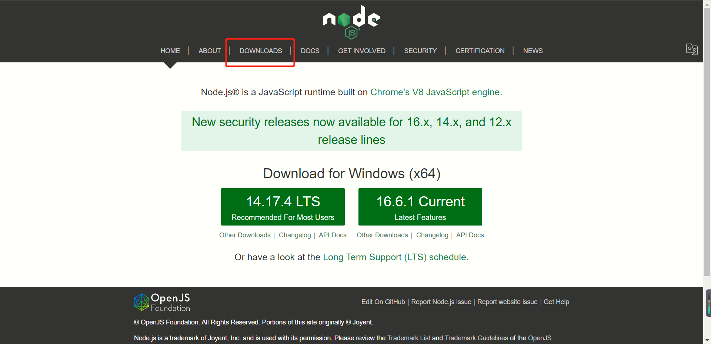
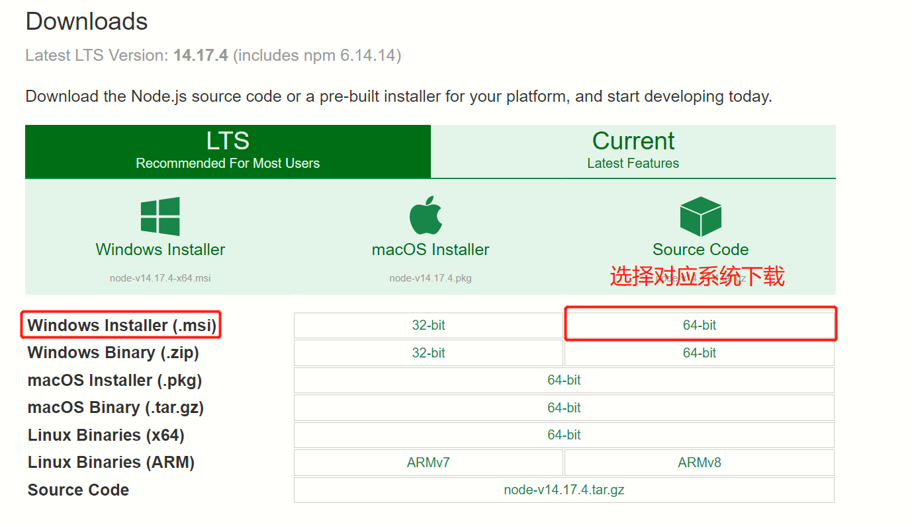

Android 环境安装(for Windows)
===

这里介绍，使用 React Native CLI 运行一个 Android 环境下的 app。

## 安装依赖
必须安装的依赖有：Node、JDK 和 Android Studio。

虽然你可以使用任何编辑器来开发应用（编写 js 代码），但你仍然必须安装 Android Studio 来获得编译 Android 应用所需的工具和环境
## Node的安装
先到 [官网](https://nodejs.org/en/)下载 node 版本,  注意 : `Node` 的版本应大于等于 `12` 下载好后无脑点击 `Next` 即可  




至此Node.js已经安装完成，可以先进行下简单的测试安装是否成功了，后面还要进行环境配置  

##### 在键盘按下【win+R】键，输入cmd，然后回车，打开cmd窗口
  


## Yarn的安装
Yarn是 Facebook 提供的替代 npm 的工具，可以加速 node 模块的下载。
```
npm install -g yarn
```
检查是否安装成功
```
yarn -v
```


## JDK的安装与配置
先到 [官网](https://www.oracle.com/java/technologies/javase/javase-jdk8-downloads.html)下载 `JDK`，会跳转到一个 `Oracler` 的登录页面，登录之后才可下载，如果没有账号可以注册一个  
注意 ：`JDK` 的版本必须是 `1.8`（目前不支持 1.9 及更高版本，注意 1.8 版本官方也直接称 8 版本）


 ##### 1.下载好了安装包后，双击进入安装向导。 
     

##### 2. 默认会在C盘，这里选择更改安装路径  
   
##### 3. 点击下一步  
  
##### 4. 安装 jre，可以更改 jre 安装路径(过程同上述安装目录的选择)。（注意：如果提示需要将 jre 安装在一个空目录下，那自己创建一个目录即可）
   

 
##### 5. 无脑点击 `下一步` 即可 安装结束，点击关闭
#### 配置环境变量
##### 1. 打开“此电脑搜索”，点击编辑系统环境变量
   

##### 2. 点击环境变量  
    
##### 3. 点击新建  
   

#####  4. 变量名：JAVA_HOME ，变量值为 jdk 的安装路径  
   
##### 5. 找到 单击 Path, 点击编辑  
   
##### 6. 点击新建，找到 jdk, jre 的 bin 文件  
  
##### 7. 点击确认  
  
  
##### 8. 检验  
快捷键win+R——> 输入cmd
```
java
javac
```
   
   
 
到此 JDK 的下载和环境变量设置完毕
## 安卓开发环境  
如果您不熟悉 Android 开发，那么设置您的开发环境可能会有些乏味。如果您已经熟悉 Android 开发，则可能需要配置一些内容。在任何一种情况下，请确保仔细遵循接下来的几个步骤。  

##### 1. 安装Android Studio  
[下载并安装 Android Studio](https://developer.android.com/studio/index.html)。如果打不开可以用 [百度网盘Android Studio](https://pan.baidu.com/s/1SDt4ttchd6wBPhPWe5zY9g) 提取码：d36k

在 Android Studio 安装向导中，确保选中以下所有项目旁边的框：

- ```Android SDK```
- ```Android SDK Platform```
- ```Android Virtual Device```
> 如果复选框变灰，您稍后将有机会安装这些组件。
<!--rehype:style=border-left: 8px solid #ffe564;background-color: #ffe56440;padding: 12px 16px;-->
设置完成并显示欢迎屏幕后，继续下一步。

##### 2. 安装Android SDK
Android Studio 默认安装最新的 Android SDK。但是，使用本机代码构建 React Native 应用程序Android 10 (Q)特别需要SDK。可以通过 Android Studio 中的 SDK Manager 安装其他 Android SDK。

为此，请打开 Android Studio，单击“Configure”按钮并选择“SDK Manager”。
##### 从 SDK 管理器中选择“SDK 平台”选项卡，然后选中右下角“Show Package Details”旁边的框。查找并展开Android 10 (Q)条目，然后确保选中以下项目：
- Android SDK Platform 29
- Intel x86 Atom_64 System Image 
   

##### 接下来，选择```“SDK Tools”```选项卡并在此处选中```“Show Package Details”```。查找并展开```“Android SDK Build-Tools”```条目，然后确保```29.0.2```选中并选中```“Android SDK Command-line Tools (latest)”```。
   
   


##### 3. 配置 ANDROID_HOME 环境变量  
eact Native 需要通过环境变量来了解你的 Android SDK 装在什么路径，从而正常进行编译
打开`控制面板` -> `系统和安全` -> `系统` -> `高级系统设置` -> `高级` -> `环境变量` -> `新建`，创建一个名为ANDROID_HOME的环境变量（系统或用户变量均可），指向你的 Android SDK 所在的目录（具体的路径可能和下图不一致，请自行确认）：
   

SDK 默认是安装在下面的目录：  
> C:\Users\你的用户名\AppData\Local\Android\Sdk
<!--rehype:style=border-left: 8px solid #ffe564;background-color: #ffe56440;padding: 12px 16px;-->

你可以在 Android Studio 的"Preferences"菜单中查看 SDK 的真实路径，具体是Appearance & Behavior → System Settings → Android SDK。
   

你需要关闭现有的命令符提示窗口然后重新打开，这样新的环境变量才能生效。
打开`控制面板` -> `系统和安全` -> `系统` -> `高级系统设置` -> `高级` -> `环境变量`，选中Path变量，然后点击编辑。点击新建然后把这些工具目录路径添加进去：platform-tools、emulator、tools、tools/bin
```
%ANDROID_HOME%\platform-tools
%ANDROID_HOME%\emulator
%ANDROID_HOME%\tools
%ANDROID_HOME%\tools\bin
```
## 创建新项目 
> 如果你之前全局安装过旧的react-native-cli命令行工具，请使用npm uninstall -g react-native-cli卸载掉它以避免一些冲突。
<!--rehype:style=border-left: 8px solid #ffe564;background-color: #ffe56440;padding: 12px 16px;-->
React Native 有一个内置的命令行界面，你可以用它来生成一个新项目。您无需使用npxNode.js 附带的全局安装任何东西即可访问它。让我们创建一个名为“AwesomeProject”的新 React Native 项目：
```
npx react-native init AwesomeProject
```
如果您将 React Native 集成到现有应用程序中，如果您从 Expo 中“退出”，或者您正在向现有 React Native 项目添加 Android 支持（请参阅[与现有应用程序集成），则不需要这样做](https://reactnative.dev/docs/integration-with-existing-apps)。您还可以使用第三方 CLI 来初始化您的 React Native 应用程序，例如[Ignite CLI](https://github.com/infinitered/ignite)。

## 使用特定版本或模板
如果你想用特定的 React Native 版本开始一个新项目，你可以使用 ```--version``` 参数：

```shell
npx react-native init AwesomeProject --version X.XX.X
```

您还可以使用自定义 React Native 模板（如 TypeScript）使用 ```--template``` 参数启动项目：

```shell
npx react-native init AwesomeTSProject --template react-native-template-typescript
```

您还可以使用我们制定的模版([@uiw/react-native-template](https://github.com/uiwjs/react-native-template))创建一个新项目：

<!--rehype:style=background-color: rgb(118 247 149);-->
```shell
npx react-native init AwesomeProject --template @uiw/react-native-template
```

>⚠️ 注意：如果上述命令失败，您可能在您的 PC 上全局安装了旧版本的 react-native 或 react-native-cli。 尝试卸载 cli 并使用 npx 运行 cli。
<!--rehype:style=border-left: 8px solid #ffe564;background-color: #ffe56440;padding: 12px 16px;-->
## 准备 Android 设备
你需要一个 Android 设备来运行你的 React Native Android 应用程序。这可以是物理 Android 设备，或者更常见的是，您可以使用 Android 虚拟设备，它允许您在计算机上模拟 Android 设备。

无论哪种方式，您都需要准备设备以运行 Android 应用程序进行开发。

### 使用物理设备
使用 Android 真机来代替模拟器进行开发，只需用 usb 数据线连接到电脑，然后遵照[在设备上运行](https://reactnative.cn/docs/running-on-device)这篇文档的说明操作即可

### 使用虚拟设备
如果您使用 Android Studio 打开`./AwesomeProject/android`，则可以通过从 Android Studio 中打开“AVD 管理器”来查看可用的 Android 虚拟设备 (AVD) 列表。寻找如下所示的图标：  

   

 如果您最近安装了 Android Studio，您可能需要创建一个新的 AVD。选择“创建虚拟设备...”，然后从列表中选择任何电话并单击“下一步”，然后选择Q API 级别 29 图像。

单击“下一步”，然后单击“完成”以创建您的 AVD。此时，您应该可以单击 AVD 旁边的绿色三角形按钮来启动它，然后继续下一步。

##### 解决AMD CPU 启动Android模拟器时无法安装Intel HAXM 的问题
如果是用的AMD的CPU，在安装Android开发环境时，遇到以下问题
```
Failed to install Intel HAXM. For details, please check the installation log: "C:\Users\zhangqs\AppData\Local\Temp\haxm_log9.txt"
HAXM installation failed. To install HAXM follow the instructions found at: https://software.intel.com/android/articles/installation-instructions-for-intel-hardware-accelerated-execution-manager-windows
Installer log is located at C:\Users\zhangqs\AppData\Local\Temp\haxm_log9.txt
Installer log contents:
=== Logging started: 2020/1/4  13:34:14 ===
This computer does not support Intel Virtualization Technology (VT-x) or it is being exclusively used by Hyper-V. HAXM cannot be installed. 
Please ensure Hyper-V is disabled in Windows Features, or refer to the Intel HAXM documentation for more information.
 
=== Logging stopped: 2020/1/4  13:34:14 ===
Done
```
根据下面图中2处红色标记就可以找到Android对应的AMD模拟器驱动
   

### 编译并运行 React Native 应用
确保你先运行了模拟器或者连接了真机，然后在你的项目目录中运行 `yarn android` 或者 `yarn react-native run-android`
```
cd AwesomeProject
yarn android
# 或者
yarn react-native run-android
```
##### 如果使用 ``` @uiw/react-native-template ``` 模版，只需<!--rehype:style=color: #0ab100;--> 
<!--rehype:style=background-color: rgb(118 247 149);-->
```shell
yarn run android
```
如果一切设置正确，您应该很快就会看到您的新应用程序在您的 Android 模拟器中运行。


```npx react-native run-android ``` 是运行您的应用程序的一种方式 - 您也可以直接从 Android Studio 中运行它。  

如果您无法使其正常工作，请参阅[故障排除页面](https://reactnative.dev/docs/troubleshooting#content)。
### 修改项目
现在你已经成功运行了项目，我们可以开始尝试动手改一改了：

- 使用你喜欢的文本编辑器打开App.js并随便改上几行
- 按两下 R 键，或是在开发者菜单中选择 Reload，就可以看到你的最新修改。
### 恭喜！
恭喜！ 您已经成功运行并修改了您的第一个 React Native 应用程序。