Android 环境安装(for Windows)
===

这里介绍，使用 React Native CLI 运行一个 Android 环境下的 app。

## 安装依赖

您将需要 `Node`、`React Native` 命令行界面、`JDK` 和 `Android Studio`。

虽然您可以使用您选择的任何编辑器来开发您的应用程序，但您需要安装 `Android Studio` 以设置必要的工具来为 `Android` 构建您的 `React Native` 应用程序。

### `Node, JDK`

我们建议通过 [`Chocolatey`](https://chocolatey.org/)（一种流行的 Windows 包管理器）安装 `Node` ~~和 `Python2`~~。

React Native 还需要 [Java Development Kit [JDK] 11](https://www.oracle.com/java/technologies/downloads/#java11) ~~以及 `Python2`~~。 两者都可以使用 Chocolatey 安装。

打开管理员命令提示符（右键单击命令提示符并选择“以管理员身份运行”），然后运行以下命令：

```shell
choco install -y nodejs.install openjdk11
```

> 🚧 如果您的系统上已经安装了 Node，请确保它是 Node 14 或更新版本。(您可以在 Node 的[下载页面](https://nodejs.org/en/download/)上找到其他安装选项。)
> 🚧 低于 0.67 版本的 React Native 需要 JDK 1.8 版本（官方也称 8 版本）。
<!--rehype:style=border-left: 8px solid #ffe564;background-color: #ffe56440;padding: 12px 16px;-->

> 🚧 在键盘按下 <kbd>win</kbd> + <kbd>R</kbd> 键，输入 `cmd`，然后回车，打开 `cmd` 窗口
<!--rehype:style=border-left: 8px solid #ffe564;background-color: #ffe56440;padding: 12px 16px;-->

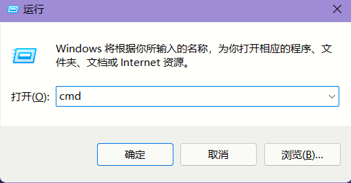<!--rehype:style=max-width: 380px;-->

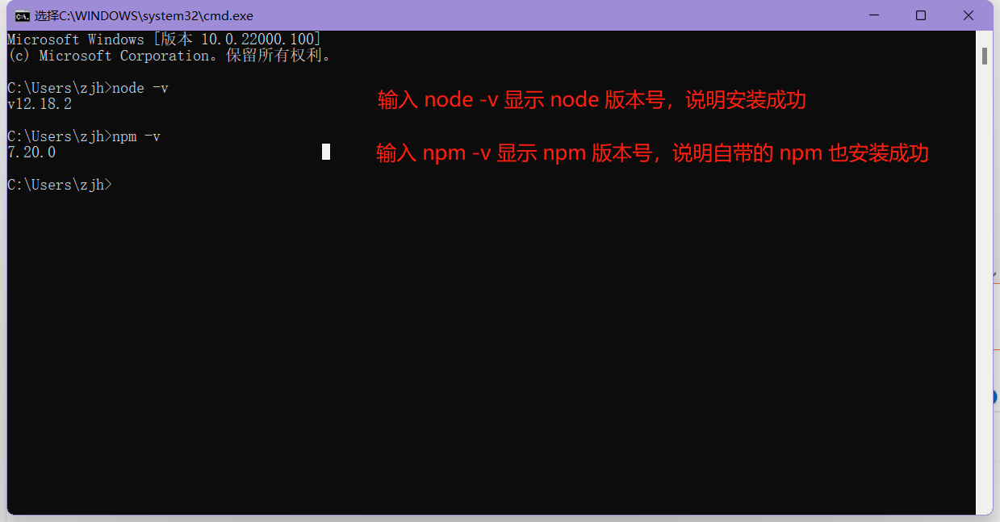<!--rehype:style=max-width: 580px;-->

> 🚧 如果您使用的是最新版本的 `Java Development Kit`，则需要更改项目的 `Gradle` 版本，以便它能够识别 `JDK`。 您可以通过转到 `{project root folder}\android\gradle\wrapper\gradle-wrapper.properties` 并更改 `distributionUrl` 值以升级 Gradle 版本来实现。 您可以在此处查看 [Gradle 的最新版本](https://gradle.org/releases/)。
<!--rehype:style=border-left: 8px solid #ffe564;background-color: #ffe56440;padding: 12px 16px;-->
<!--rehype:style=border-left: 8px solid #ffe564;background-color: #ffe56440;padding: 12px 16px;-->

```
# 使用nrm工具切换淘宝源
npx nrm use taobao

# 如果之后需要切换回官方源可使用
npx nrm use npm
```

### `Yarn 的安装`

Yarn 是 Facebook 提供的替代 npm 的工具，可以加速 node 模块的下载。

```shell
npm install -g yarn
```

检查是否安装成功

```shell
yarn -v
```

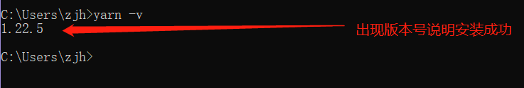<!--rehype:style=max-width: 380px;-->

## 安卓开发环境

先到 [官网](https://www.oracle.com/java/technologies/downloads/#java11)下载 `JDK`，会跳转到一个 `Oracler` 的登录页面，登录之后才可下载，如果没有账号可以注册一个  
注意 ：`JDK` 的版本必须是 `11`（低于 0.67 版本的 React Native 需要 JDK 1.8 版本（官方也称 8 版本））

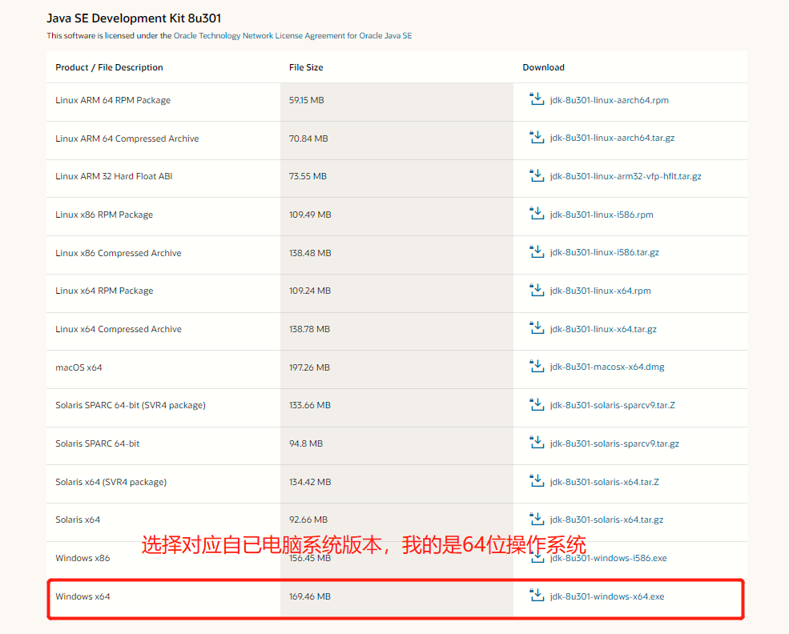<!--rehype:style=max-width: 480px;-->

`1.`<!--rehype:style=background: #a5d4ff;--> 下载好了安装包后，双击进入安装向导。 

    

`2.`<!--rehype:style=background: #a5d4ff;--> 默认会在C盘，这里选择更改安装路径  

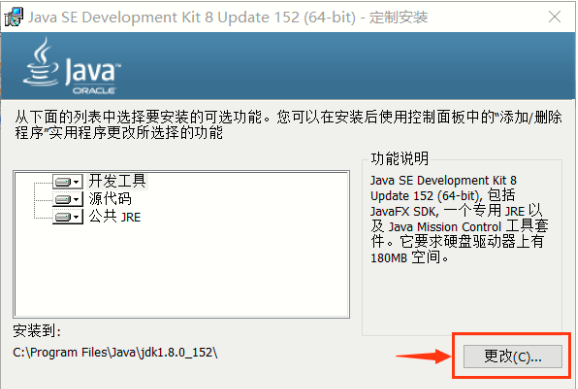<!--rehype:style=max-width: 380px;-->

`3.`<!--rehype:style=background: #a5d4ff;--> 点击下一步  

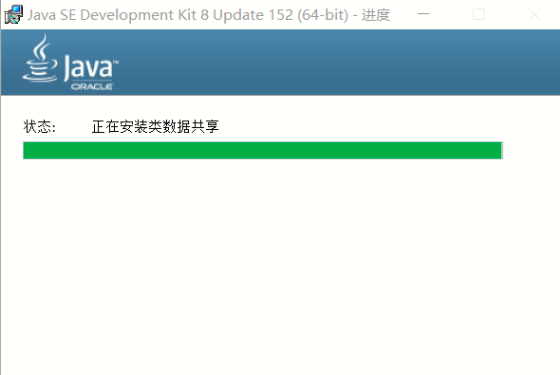<!--rehype:style=max-width: 320px;-->

`4.`<!--rehype:style=background: #a5d4ff;--> 安装 jre，可以更改 jre 安装路径(过程同上述安装目录的选择)。（注意：如果提示需要将 jre 安装在一个空目录下，那自己创建一个目录即可）

 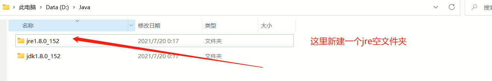<!--rehype:style=max-width: 580px;-->

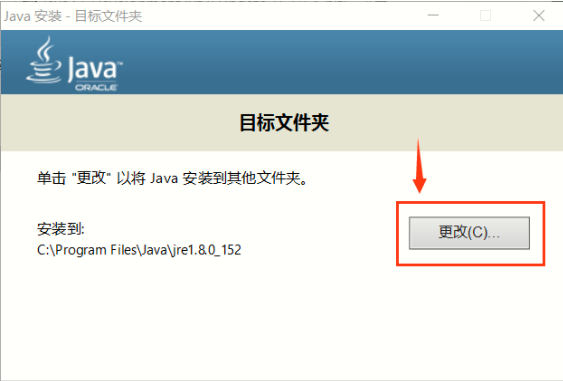<!--rehype:style=max-width: 380px;-->

`5.`<!--rehype:style=background: #a5d4ff;--> 无脑点击 `下一步` 即可 安装结束，点击关闭

## 配置环境变量

`1`<!--rehype:style=background: #a5d4ff;--> 打开“此电脑搜索”，点击编辑系统环境变量

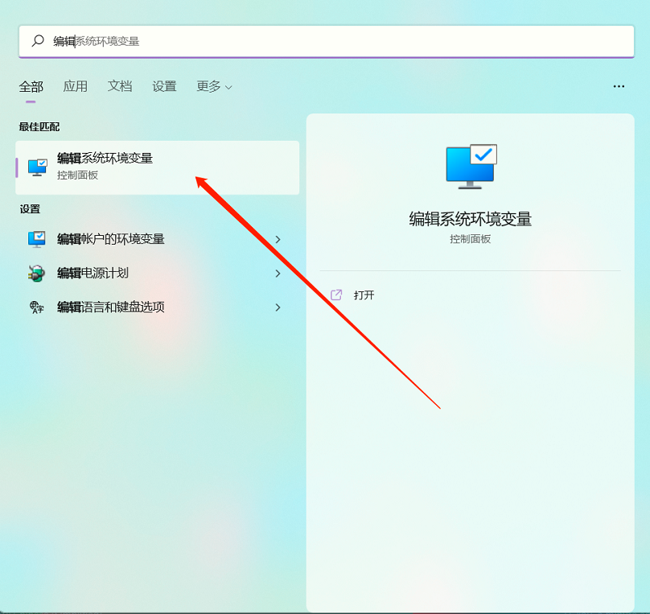<!--rehype:style=max-width: 420px;-->

`2`<!--rehype:style=background: #a5d4ff;--> 点击环境变量  

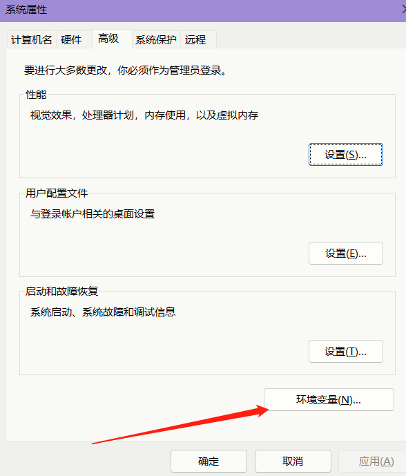<!--rehype:style=max-width: 420px;-->

`3`<!--rehype:style=background: #a5d4ff;--> 点击新建  

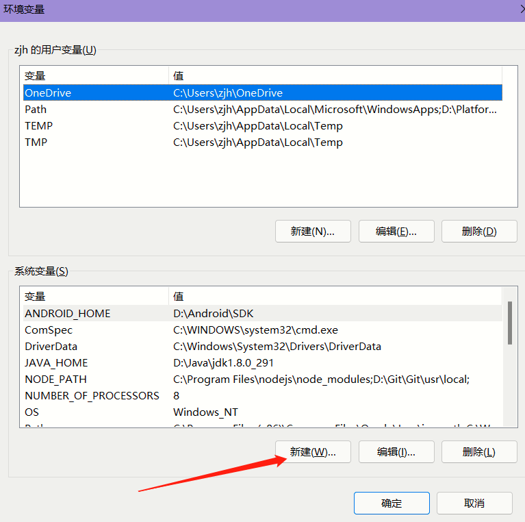<!--rehype:style=max-width: 420px;-->

`4`<!--rehype:style=background: #a5d4ff;--> 变量名：`JAVA_HOME`，变量值为 `jdk` 的安装路径  

默认情况下，`SDK` 安装在以下位置：

```shell
%LOCALAPPDATA%\Android\Sdk
```

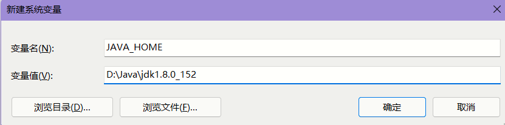<!--rehype:style=max-width: 420px;-->

`5`<!--rehype:style=background: #a5d4ff;--> 找到 单击 Path, 点击编辑  

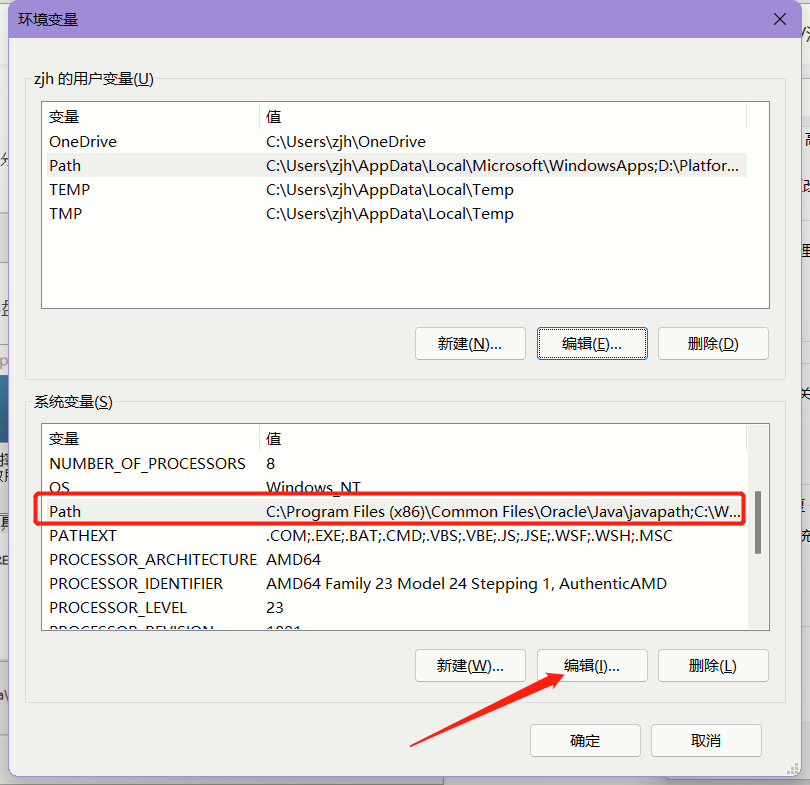<!--rehype:style=max-width: 420px;-->

`6`<!--rehype:style=background: #a5d4ff;--> 点击新建，找到 jdk, jre 的 bin 文件  

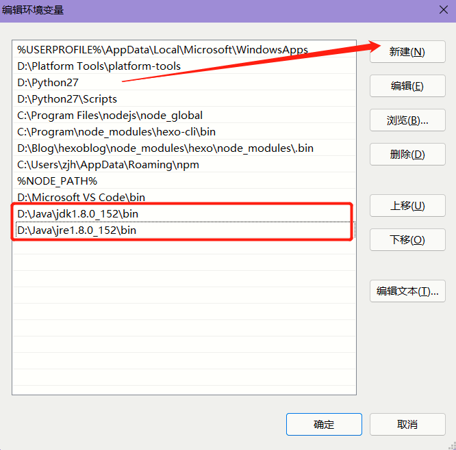<!--rehype:style=max-width: 420px;-->

`7`<!--rehype:style=background: #a5d4ff;--> 点击确认  

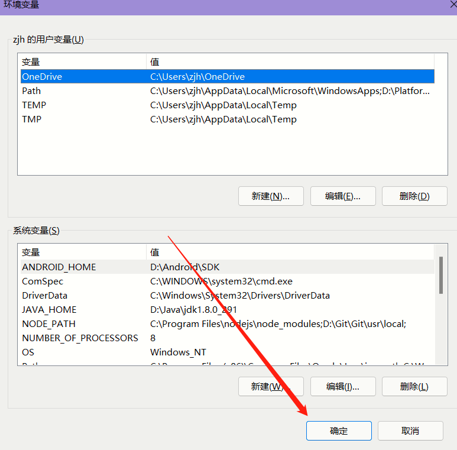<!--rehype:style=max-width: 420px;-->

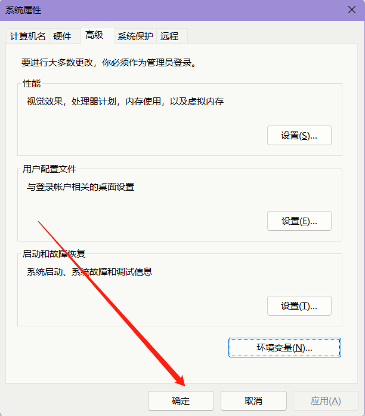<!--rehype:style=max-width: 420px;-->

`8`<!--rehype:style=background: #a5d4ff;--> 检验  

快捷键 <kbd>win</kbd> + <kbd>R</kbd> ——> 输入 `cmd`

```shell
java
javac
```
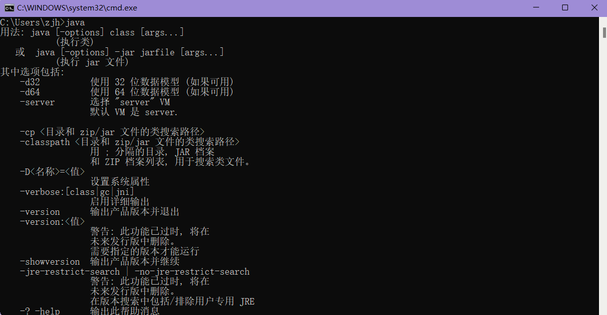<!--rehype:style=max-width: 580px;-->

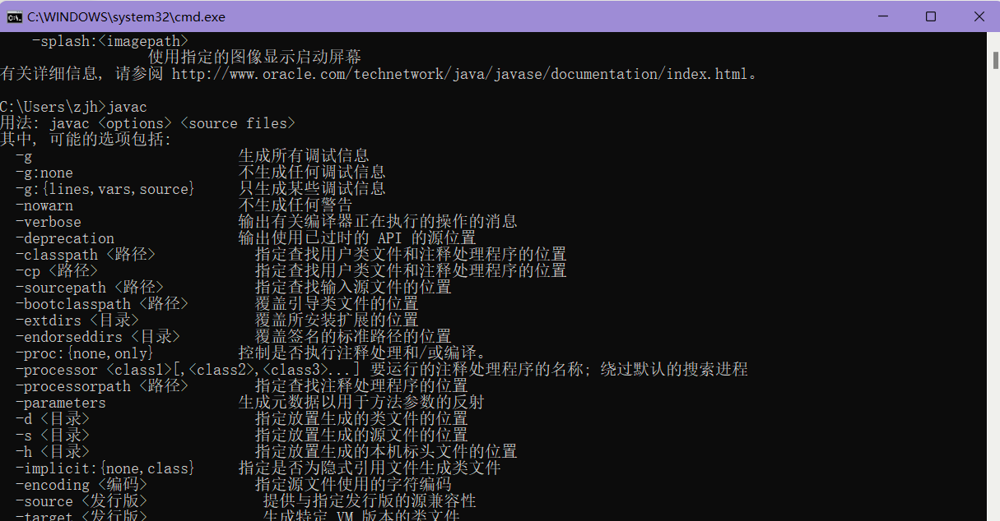<!--rehype:style=max-width: 580px;-->
 
到此 JDK 的下载和环境变量设置完毕


## 安卓开发环境

如果您不熟悉 Android 开发，那么设置您的开发环境可能会有些乏味。如果您已经熟悉 Android 开发，则可能需要配置一些内容。在任何一种情况下，请确保仔细遵循接下来的几个步骤。

#### `第 1 步`<!--rehype:style=background: #a5d4ff;--> 安装Android Studio

下载并安装 [Android Studio](https://developer.android.google.cn/studio)。 在 Android Studio 安装向导中，确保选中以下所有项目旁边的框：

- `Android SDK`
- `Android SDK Platform`
- `Android Virtual Device`
- 如果您尚未使用 Hyper-V：`Performance (Intel ® HAXM)`（[请参阅此处](https://android-developers.googleblog.com/2018/07/android-emulator-amd-processor-hyper-v.html)了解 AMD 或 Hyper-V）

> 🚧 如果复选框变灰，您稍后将有机会安装这些组件。
<!--rehype:style=border-left: 8px solid #ffe564;background-color: #ffe56440;padding: 12px 16px;-->


> 🚧 如果打不开，或者无法下载 [Android Studio](https://developer.android.google.cn/studio) 请确认下载地址 ~~`developer.android.com`~~ -> `developer.android.google.cn`。
<!--rehype:style=border-left: 8px solid #ffe564;background-color: #ffe56440;padding: 12px 16px; display: inline-block;-->

设置完成并显示欢迎屏幕后，继续下一步。

#### `第 2 步`<!--rehype:style=background: #a5d4ff;--> 安装 Android SDK

Android Studio 默认安装最新的 Android SDK。 但是，使用本机代码构建 React Native 应用程序特别需要 `Android 12 (S)` SDK (注意 SDK 版本不等于终端系统版本，RN 目前支持 android 5 以上设备。) 可以通过 Android Studio 中的 SDK Manager 安装其他 Android SDK。

为此，请打开 Android Studio，单击 `Configure` 按钮并选择 `SDK Manager`。

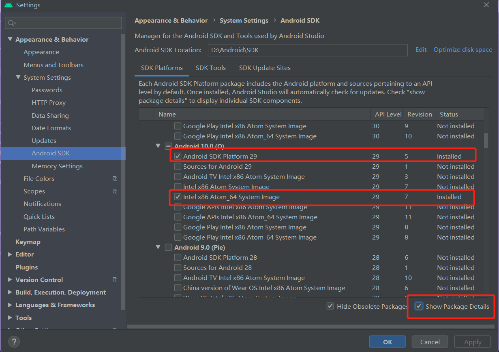<!--rehype:style=max-width: 580px;-->


> 🚧 `SDK Manager` 也可以在 Android Studio 的 `Preferences` 对话框中找到，在 `Appearance & Behavior` → `System Settings` → `Android SDK` 下。
<!--rehype:style=border-left: 8px solid #ffe564;background-color: #ffe56440;padding: 12px 16px;-->

从 `SDK Manager` 中选择 `SDK Platforms` 选项卡，然后选中右下角 `Show Package Details` 旁边的框。 查找并展开 `Android 12 (S)` 条目，然后确保选中以下项目：

- `Android SDK Platform 31`
- `Intel x86 Atom_64 System Image` or `Google APIs Intel x86 Atom System Image`

接下来，选择 `SDK Tools` 选项卡并在此处选中 `Show Package Details` 旁边的框。 查找并展开 `Android SDK Build-Tools` 条目，然后确保选择了 `31.0.0`。

最后，点击 `Apply` 下载并安装 Android SDK 和相关的构建工具。

接下来，选择 `SDK Tools` 选项卡并在此处选中 `Show Package Details` 旁边的框。 查找并展开 `Android SDK Build-Tools` 条目，然后确保选择了 `31.0.0`。选中并 `Android SDK Command-line Tools (latest)`

<!-- 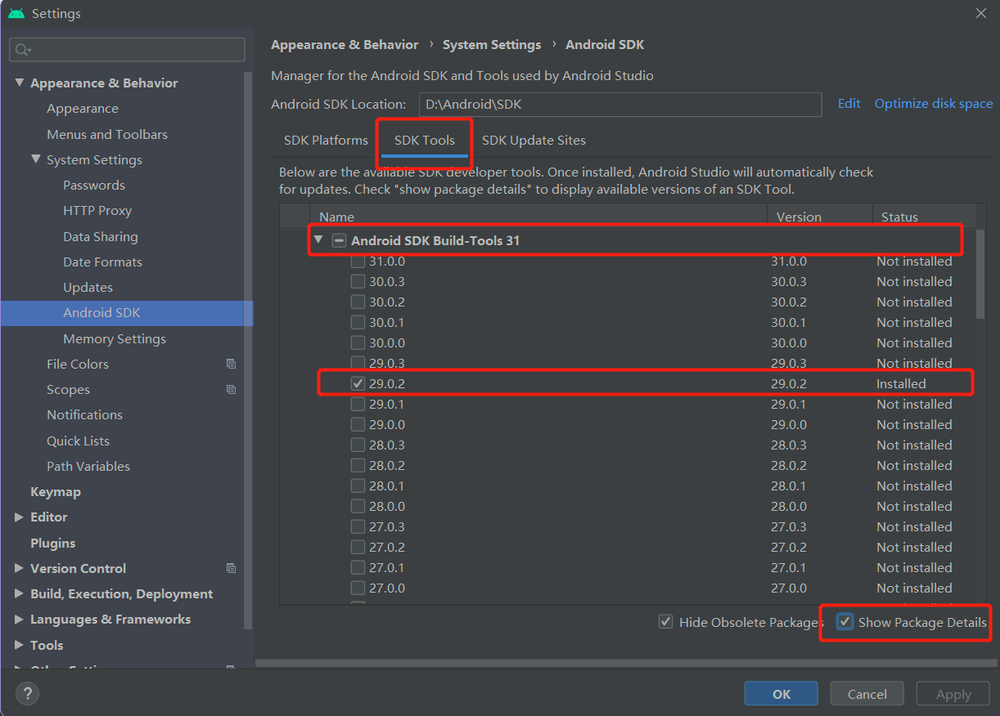 --><!--rehype:style=max-width: 580px;-->

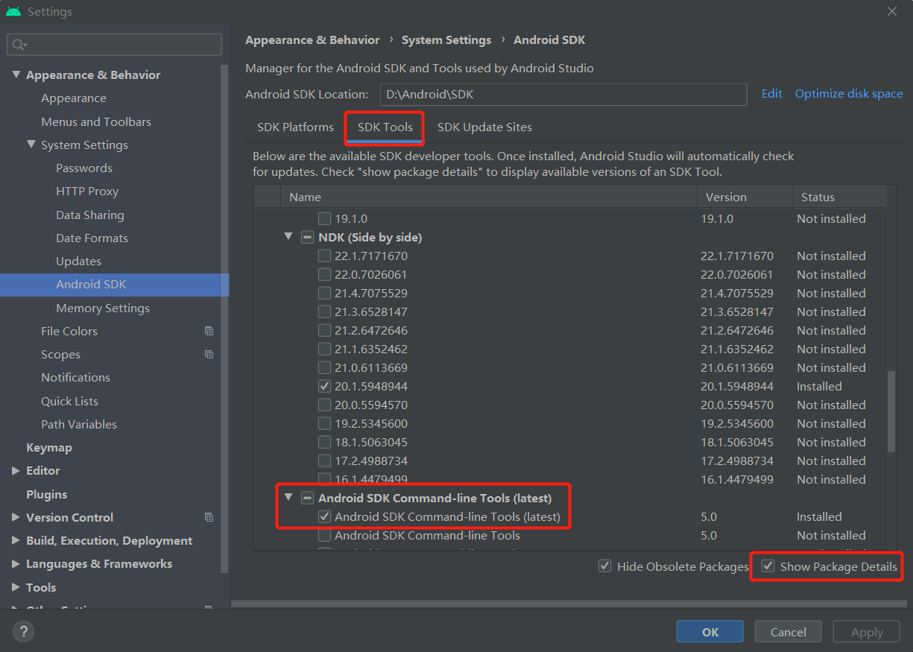<!--rehype:style=max-width: 580px;-->


#### `第 3 步`<!--rehype:style=background: #a5d4ff;--> 配置 ANDROID_HOME 环境变量  

React Native 需要通过环境变量来了解你的 Android SDK 装在什么路径，从而正常进行编译，打开 `控制面板` -> `系统和安全` -> `系统` -> `高级系统设置` -> `高级` -> `环境变量` -> `新建`，创建一个名为ANDROID_HOME的环境变量（系统或用户变量均可），指向你的 Android SDK 所在的目录（具体的路径可能和下图不一致，请自行确认）：

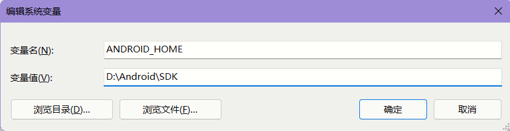<!--rehype:style=max-width: 580px;-->

SDK 默认是安装在下面的目录：

> 🚧 C:\Users\你的用户名\AppData\Local\Android\Sdk
<!--rehype:style=border-left: 8px solid #ffe564;background-color: #ffe56440;padding: 12px 16px;-->

你可以在 Android Studio 的 `Preferences` 菜单中查看 `SDK` 的真实路径，具体是 `Appearance & Behavior` → `System Settings` → `Android SDK`。

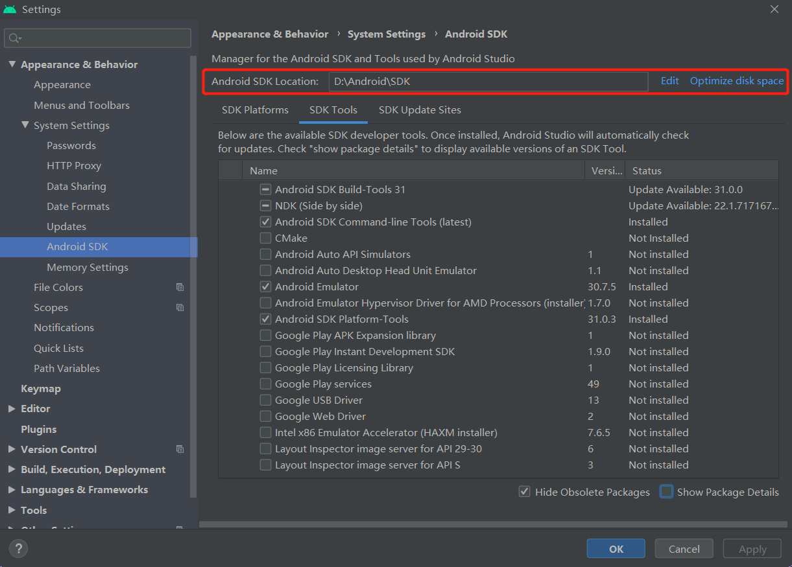<!--rehype:style=max-width: 580px;-->

你需要关闭现有的命令符提示窗口然后重新打开，这样新的环境变量才能生效。
打开`控制面板` -> `系统和安全` -> `系统` -> `高级系统设置` -> `高级` -> `环境变量`，选中 `Path` 变量，然后点击编辑。点击新建然后把这些工具目录路径添加进去：`platform-tools`、`emulator`、`tools`、`tools/bin`

```bash
%ANDROID_HOME%\platform-tools
%ANDROID_HOME%\emulator
%ANDROID_HOME%\tools
%ANDROID_HOME%\tools\bin
```
## 创建一个新的应用程序

> 🚧 如果你之前全局安装过旧的 `react-native-cli` 命令行工具，请使用 `npm uninstall -g react-native-cli` 卸载掉它以避免一些冲突。
<!--rehype:style=border-left: 8px solid #ffe564;background-color: #ffe56440;padding: 12px 16px;-->

您可以使用 React Native 的内置命令行界面来生成一个新项目。 让我们创建一个名为 `AwesomeProject` 的新 React Native 项目：

> 🚧 必须要看的注意事项一： 请`不要`在目录、文件名中使用`中文、空格`等特殊符号。请`不要`单独使用常见的关键字作为项目名（如 class, native, new, package 等等）。请`不要`使用与核心模块同名的项目名（如 react, react-native 等）。
<!--rehype:style=border-left: 8px solid #ffe564;background-color: #ffe56440;padding: 12px 16px;-->

> 🚧 必须要看的注意事项二：请`不要`在某些权限敏感的目录例如 System32 目录中 init 项目！会有各种权限限制导致不能运行！
<!--rehype:style=border-left: 8px solid #ffe564;background-color: #ffe56440;padding: 12px 16px;-->

> 🚧 必须要看的注意事项三：请`不要`使用一些移植的终端环境，例如`git bash`或`mingw`等等，这些在 windows 下可能导致找不到环境变量。请使用系统自带的命令行（CMD 或 powershell）运行。
<!--rehype:style=border-left: 8px solid #ffe564;background-color: #ffe56440;padding: 12px 16px;-->
<!--rehype:style=border-left: 8px solid #ffe564;background-color: #ffe56440;padding: 12px 16px;-->

```shell
npx react-native init AwesomeProject
```

如果您将 React Native 集成到现有应用程序中，如果您从 Expo 中“退出”，或者您正在向现有 React Native 项目添加 Android 支持（请参阅[与现有应用程序集成），则不需要这样做](https://reactnative.dev/docs/integration-with-existing-apps)。您还可以使用第三方 CLI 来初始化您的 React Native 应用程序，例如[Ignite CLI](https://github.com/infinitered/ignite)。

### `使用特定版本或模板`

如果你想用特定的 React Native 版本开始一个新项目，你可以使用 `--version` 参数：

```shell
npx react-native init AwesomeProject --version X.XX.X
```

您还可以使用自定义 React Native 模板（如 TypeScript）使用 `--template` 参数启动项目：

```shell
npx react-native init AwesomeTSProject --template react-native-template-typescript
```

您还可以使用我们制定的模版([@uiw/react-native-template](https://github.com/uiwjs/react-native-template))创建一个新项目：

<!--rehype:style=background-color: rgb(118 247 149);-->
```shell
# 此模板默认集成了一些必用的依赖，如路由，组件库等
npx react-native init AwesomeProject --template @uiw/react-native-template
```

> 🚧 注意：如果上述命令失败，您可能在您的 PC 上全局安装了旧版本的 react-native 或 react-native-cli。 尝试卸载 `cli` 并使用 `npx` 运行 cli。
<!--rehype:style=border-left: 8px solid #ffe564;background-color: #ffe56440;padding: 12px 16px;-->

## 准备 Android 设备

你需要一个 Android 设备来运行你的 React Native Android 应用程序。这可以是物理 Android 设备，或者更常见的是，您可以使用 Android 虚拟设备，它允许您在计算机上模拟 Android 设备。

无论哪种方式，您都需要准备设备以运行 Android 应用程序进行开发。

### `使用物理设备`

使用 Android 真机来代替模拟器进行开发，只需用 usb 数据线连接到电脑，然后遵照[在设备上运行](https://reactnative.cn/docs/running-on-device)这篇文档的说明操作即可

### `使用虚拟设备`

如果您使用 Android Studio 打开 `./AwesomeProject/android`，您可以通过从 Android Studio 中打开 `AVD Manager` 来查看可用的 Android 虚拟设备 (AVD) 列表。 寻找如下所示的图标： 

 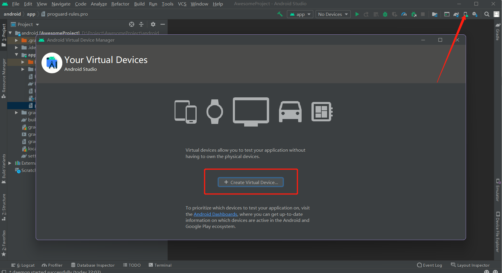<!--rehype:style=max-width: 580px;-->

如果您最近安装了 Android Studio，您可能需要创建一个新的 AVD。选择 `创建虚拟设备...`，然后从列表中选择任何电话并单击“下一步”，然后选择Q API 级别 29 图像。

单击“下一步”，然后单击“完成”以创建您的 AVD。此时，您应该可以单击 AVD 旁边的绿色三角形按钮来启动它，然后继续下一步。

### 解决 AMD CPU 启动 Android 模拟器时无法安装 Intel HAXM 的问题

如果是用的 AMD 的 CPU，在安装 Android 开发环境时，遇到以下问题

```shell
Failed to install Intel HAXM. For details, please check the installation log: "C:\Users\zhangqs\AppData\Local\Temp\haxm_log9.txt"
HAXM installation failed. To install HAXM follow the instructions found at: https://software.intel.com/android/articles/installation-instructions-for-intel-hardware-accelerated-execution-manager-windows
Installer log is located at C:\Users\zhangqs\AppData\Local\Temp\haxm_log9.txt
Installer log contents:
=== Logging started: 2020/1/4  13:34:14 ===
This computer does not support Intel Virtualization Technology (VT-x) or it is being exclusively used by Hyper-V. HAXM cannot be installed. 
Please ensure Hyper-V is disabled in Windows Features, or refer to the Intel HAXM documentation for more information.
 
=== Logging stopped: 2020/1/4  13:34:14 ===
Done
```

根据下面图中2处红色标记就可以找到 Android 对应的 AMD 模拟器驱动

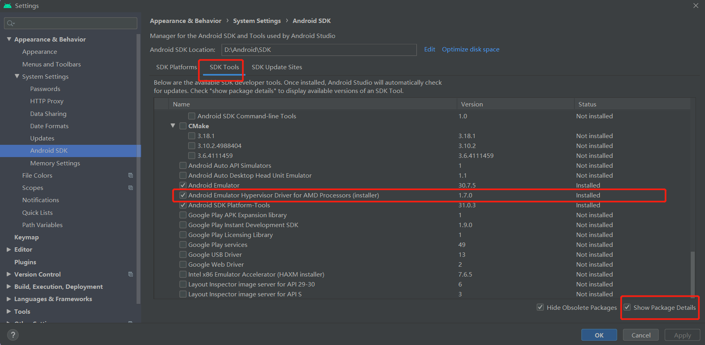<!--rehype:style=max-width: 680px;-->

### 编译并运行 React Native 应用

确保你先运行了模拟器或者连接了真机，然后在你的项目目录中运行 `yarn android` 或者 `yarn react-native run-android`

```shell
cd AwesomeProject
yarn android
# 或者
yarn react-native run-android
```

> 如果使用 `@uiw/react-native-template` 模版，只需<!--rehype:style=color: #0ab100;--> 
<!--rehype:style=background-color: rgb(118 247 149);-->

```shell
yarn run android
```

如果一切设置正确，您应该很快就会看到您的新应用程序在您的 Android 模拟器中运行。


`npx react-native run-android` 是运行您的应用程序的一种方式 - 您也可以直接从 Android Studio 中运行它。

> 注：建议在`run-android`成功后再尝试使用 Android Studio 启动。请不要轻易点击 Android Studio 中可能弹出的建议更新项目中某依赖项的建议，否则可能导致无法运行。
<!--rehype:style=border-left: 8px solid #ffe564;background-color: #ffe56440;padding: 12px 16px;--> 

如果您无法使其正常工作，请参阅[故障排除页面](https://reactnative.dev/docs/troubleshooting#content)。

## 开发模式弹出开发者菜单刷新应用

命令行支持*打开开发者菜单*，和其它的一些操作

1. `r` - 重新加载应用
2. `d` - 打开开发者菜单
3. `i` - 在 iOS 上运行
4. `a` - 在 Android 上运行

按两次 <kbd>R</kbd> 键或从开发者菜单(<kbd>⌘</kbd><kbd>M</kbd>)中选择重新加载(Reload)以预览您的更改。

> 如果没有起作用可以在命令行使用 `adb shell input keyevent 82` 命令唤起**开发者菜单**

### 修改项目

现在你已经成功运行了项目，我们可以开始尝试动手改一改了：

- 使用你喜欢的文本编辑器打开 `App.js` 并随便改上几行
- 按两下 <kbd>R</kbd><!--rehype:style=color: red; background: #ffd2d2; box-shadow: inset 0 -1px 0 #ff7171; border-bottom-color: #fb5454; border: 1px solid #ffa4a3;--> 键，或是在开发者菜单中选择 `Reload`，就可以看到你的最新修改。

### 恭喜！

恭喜！ 您已经成功运行并修改了您的第一个 React Native 应用程序。