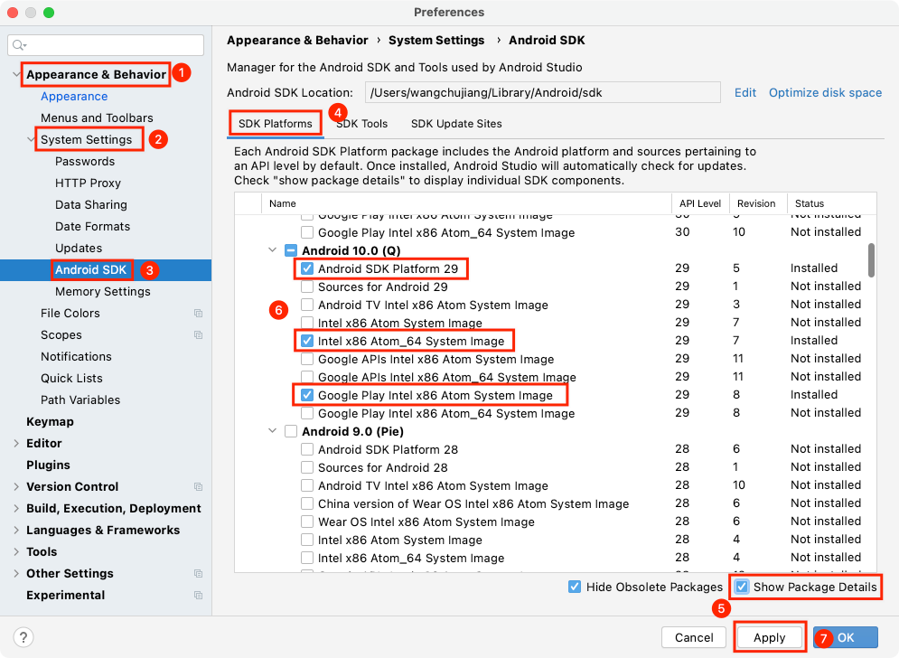
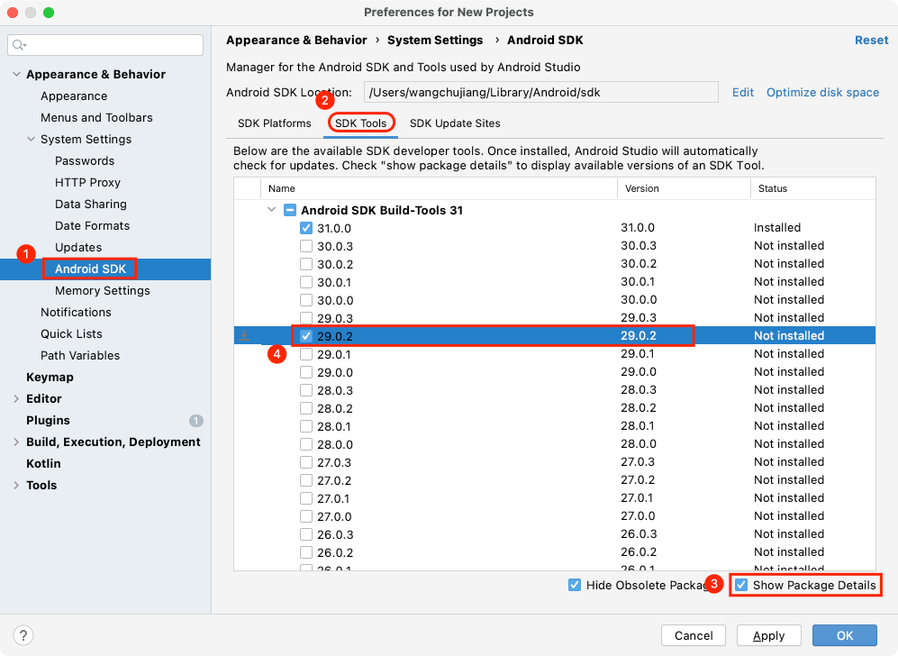

Android 环境安装(for Mac)
===

这里介绍，使用 React Native CLI 运行一个 Android 环境下的 app。您将需要 Node、Watchman、React Native 命令行界面、JDK 和 Android Studio。

虽然您可以使用您选择的任何编辑器来开发您的应用程序，但您需要安装 Android Studio 以设置必要的工具来构建您的 React Native 应用程序。

## 安装依赖

您将需要 [Node](https://nodejs.org)、[Watchman](https://facebook.github.io/watchman)、[React Native](https://github.com/react-native-community/cli) 命令行界面、JDK 和 Android Studio。

虽然您可以使用您选择的任何编辑器来开发您的应用程序，但您需要安装 Android Studio 以设置必要的工具来构建您的 React Native 应用程序。

### `Node & Watchman`

我们建议使用 [Homebrew](http://brew.sh/) 安装 [Node](https://nodejs.org) 和 [Watchman](https://facebook.github.io/watchman)。 安装 [Homebrew](http://brew.sh/) 后，在终端中运行以下命令：

```shell
brew install node
brew install watchman
```

如果您的系统上已经安装了 Node，请确保它是 Node 14 或更新版本。

> 🚧 注意：不要使用 cnpm！cnpm 安装的模块路径比较奇怪，packager 不能正常识别！
<!--rehype:style=border-left: 8px solid #ffe564;background-color: #ffe56440;padding: 12px 16px;-->
<!--rehype:style=border-left: 8px solid #ffe564;background-color: #ffe56440;padding: 12px 16px;-->

```shell
# 使用nrm工具切换淘宝源
npx nrm use taobao

# 如果之后需要切换回官方源可使用
npx nrm use npm
```


[Watchman](https://facebook.github.io/watchman/) 是 Facebook 的一个工具，用于观察文件系统中的变化。强烈建议您安装它以获得更好的性能。

### `Yarn`

[Yarn](https://yarnpkg.com/) 是 Facebook 提供的替代 npm 的工具，可以加速 node 模块的下载

```
npm install -g yarn
```

安装完 yarn 之后就可以用 yarn 代替 npm 了，例如用`yarn`代替`npm install`命令，用`yarn add 某第三方库名`代替`npm install 某第三方库名`。

### `Java 开发工具包`

我们建议使用 [Homebrew](http://brew.sh/) 安装 JDK。 安装 Homebrew 后，在终端中运行以下命令：

```shell
brew tap homebrew/cask-versions
brew install --cask zulu11
```

Zulu OpenJDK 发行版为 Intel 和 M1 Mac 提供了 JDK。与使用基于 Intel 的 JDK 相比，这将确保您在 M1 Mac 上的构建速度更快。

你可以在命令行中输入 `javac -version`（请注意是 javac，不是 java）来查看你当前安装的 JDK 版本。

```shell
$ javac -version
javac 11.0.16
```

> 🚧 低于 `0.67` 版本的 React Native 需要 JDK 1.8 版本（官方也称 8 版本），高于 `0.67+` 版本的 React Native，请确保它是 `JDK 11`<!--rehype:style=color: #fff;background: #f44336;--> 或更高版本。
<!--rehype:style=border-left: 8px solid #ffe564;background-color: #ffe56440;padding: 12px 16px; display: inline-block;-->

### `安卓开发环境`

如果您不熟悉 Android 开发，那么设置您的开发环境可能会有些乏味。 如果您已经熟悉 Android 开发，则可能需要配置一些内容。 在任何一种情况下，请确保仔细遵循接下来的几个步骤。

#### `第 1 步`<!--rehype:style=background: #a5d4ff;--> 安装 Android Studio

下载并安装 [Android Studio](https://developer.android.google.cn/studio)。 在 Android Studio 安装向导中，确保选中以下所有项目旁边的框：

> 🚧 如果打不开，或者无法下载 [Android Studio](https://developer.android.google.cn/studio) 请确认下载地址 ~~`developer.android.com`~~ -> `developer.android.google.cn`。
<!--rehype:style=border-left: 8px solid #ffe564;background-color: #ffe56440;padding: 12px 16px; display: inline-block;-->

> 🚧 注意：如果您是 `MacBook M1`<!--rehype:style=color: #e00000;-->，你需要下载最新版 [`android-studio-2021.2.1.16-mac_arm.dmg`](https://developer.android.google.cn/studio/archive) 。如果是 [`Android Studio Arctic Fox (2020.3.1) Canary 15, Mac (ARM)`](https://developer.android.google.cn/studio/archive) 预览版可以更新解决一些环境错误问题。
<!--rehype:style=border-left: 8px solid #ffe564;background-color: #ffe56440;padding: 12px 16px;-->

在 Android Studio 安装向导中，确保选中以下所有项目旁边的框：

- `Android SDK`
- `Android SDK Platform`
- `Android Virtual Device`
- 如果您尚未使用 Hyper-V：`Performance (Intel ® HAXM)`（[请参阅此处](https://android-developers.googleblog.com/2018/07/android-emulator-amd-processor-hyper-v.html)了解 AMD 或 Hyper-V）

> 🚧 如果复选框变灰，您也可以先跳过，稍后再来安装这些组件。
<!--rehype:style=border-left: 8px solid #ffe564;background-color: #ffe56440;padding: 12px 16px;-->

设置完成并显示欢迎屏幕后，继续下一步。

#### `第 2 步`<!--rehype:style=background: #a5d4ff;--> 安装 Android SDK

Android Studio 默认安装最新的 Android SDK。 但是，使用本机代码构建 React Native 应用程序特别需要 `Android 12 (S)` SDK。 可以通过 Android Studio 中的 SDK Manager 安装其他 Android SDK。

为此，请打开 Android Studio，单击 `Configure` 按钮并选择 `SDK Manager`。


> 🚧 `SDK Manager` 也可以在 Android Studio 的 `Preferences` 对话框中找到，在 `Appearance & Behavior` → `System Settings` → `Android SDK` 下。
<!--rehype:style=border-left: 8px solid #ffe564;background-color: #ffe56440;padding: 12px 16px;-->

从 `SDK Manager` 中选择 `SDK Platforms` 选项卡，然后选中右下角 `Show Package Details` 旁边的框。 查找并展开 `Android 12 (S)` 条目，然后确保选中以下项目：

- `Android SDK Platform 31`
- `Intel x86 Atom_64 System Image` 或 `Google APIs Intel x86 Atom System Image` 或 (for Apple M1 Silicon) `Google APIs ARM 64 v8a System Image`



接下来，选择 `SDK Tools` 选项卡并在此处选中 `Show Package Details` 旁边的框。 查找并展开 `Android SDK Build-Tools` 条目，然后确保选择了 `31.0.0`。



最后，点击 `Apply` 下载并安装 Android SDK 和相关的构建工具。


#### `第 3 步`<!--rehype:style=background: #a5d4ff;--> 配置 ANDROID_HOME 环境变量

React Native 工具需要设置一些环境变量才能使用本机代码构建应用程序。

将以下行添加到您的 `$HOME/.bash_profile` 或 `$HOME/.bashrc`（如果您使用的是 `zsh`，则使用 `~/.zprofile` 或 `~/.zshrc`；如果是 `bash` 则为`~/.bash_profile`）配置文件：

```shell
# 如果你不是通过Android Studio安装的sdk，则其路径可能不同，请自行确定清楚
export ANDROID_SDK_ROOT=$HOME/Library/Android/sdk
export PATH=$PATH:$ANDROID_SDK_ROOT/emulator
export PATH=$PATH:$ANDROID_SDK_ROOT/tools
export PATH=$PATH:$ANDROID_SDK_ROOT/tools/bin
export PATH=$PATH:$ANDROID_SDK_ROOT/platform-tools
```

> 🚧 `.bash_profile` 特定于 `bash`。 如果您使用另一个 `shell`，则需要编辑相应的特定于 `shell` 的配置文件。
<!--rehype:style=border-left: 8px solid #ffe564;background-color: #ffe56440;padding: 12px 16px;-->

输入 `source $HOME/.bash_profile` for bash 或 `source $HOME/.zprofile` 将配置加载到当前 `shell` 中。 通过运行 `echo $ANDROID_HOME` 验证 `ANDROID_HOME` 是否已设置，并通过运行 `echo $PATH` 将适当的目录添加到您的路径中。

> 请确保您使用正确的 `Android SDK` 路径。 您可以在 `Android Studio` 的 `Preferences` 对话框的 `Appearance & Behavior` → `System Settings` → `Android SDK` 下找到 SDK 的实际位置。
<!--rehype:style=border-left: 8px solid #ffe564;background-color: #ffe56440;padding: 12px 16px;-->

### `React Native 命令行界面`

React Native 有一个内置的命令行界面。 我们建议您在运行时使用 Node.js 附带的 `npx` 访问当前版本，而不是全局安装和管理特定版本的 CLI。 使用 `npx react-native <command>`，当前稳定版本的 CLI 将在命令运行时下载并执行。

> 使用 npx（推荐），自 react-native@0.60 起可用。
<!--rehype:style=border-left: 8px solid #ffe564;background-color: #ffe56440;padding: 12px 16px;-->

## 创建一个新的应用程序

> 🚧 如果您之前安装了全局 `react-native-cli` 包，请将其删除 (`npm uninstall -g react-native-cli`)，因为它可能会导致意外问题。
<!--rehype:style=border-left: 8px solid #ffe564;background-color: #ffe56440;padding: 12px 16px;-->

您可以使用 React Native 的内置命令行界面来生成一个新项目。 让我们创建一个名为 `AwesomeProject` 的新 React Native 项目：

```shell
npx react-native init AwesomeProject
```

如果您将 React Native 集成到现有应用程序中，如果您从 Expo 中 `ejected`，或者您正在向现有 React Native 项目添加 iOS 支持（请参阅[与现有应用程序集成](https://reactnative.dev/docs/integration-with-existing-apps)），则不需要这样做。 您还可以使用第三方 CLI 来初始化您的 React Native 应用程序，例如 [Ignite CLI](https://github.com/infinitered/ignite)。

### `使用特定版本或模板`

如果你想用特定的 React Native 版本开始一个新项目，你可以使用 `--version` 参数：

```bash
npx react-native init AwesomeProject --version X.XX.X
```

您还可以使用自定义 React Native 模板（如 TypeScript）使用 `--template` 参数启动项目：

>🚧 必须要看的注意事项：请`不要`单独使用常见的关键字作为项目名（如 class, native, new, package 等等）。请不要使用与核心模块同名的项目名（如 react, react-native 等）。请不要在目录、文件名中使用中文、空格等特殊符号。
<!--rehype:style=border-left: 8px solid #ffe564;background-color: #ffe56440;padding: 12px 16px;-->

```bash
npx react-native init AwesomeTSProject --template react-native-template-typescript
```

您还可以使用我们制定的模版([`@uiw/react-native-template`](https://github.com/uiwjs/react-native-template))创建一个新项目：

<!--rehype:style=background-color: rgb(118 247 149);-->
```shell
# 此模板默认集成了一些必用的依赖，如路由，组件库等
npx react-native init AwesomeProject --template @uiw/react-native-template
```

> 🚧 注意：如果上述命令失败，您可能在您的 PC 上全局安装了旧版本的 react-native 或 react-native-cli。 尝试卸载 `cli` 并使用 `npx` 运行 cli。
<!--rehype:style=border-left: 8px solid #ffe564;background-color: #ffe56440;padding: 12px 16px;-->

## 准备 Android 设备

你需要一个 Android 设备来运行你的 React Native Android 应用程序。 这可以是物理 Android 设备，或者更常见的是，您可以使用 Android 虚拟设备，它允许您在计算机上模拟 Android 设备。

无论哪种方式，您都需要准备设备以运行 Android 应用程序进行开发。

### `使用物理设备`

如果您有一个物理 `Android` 设备，您可以使用它来代替 `AVD` 进行开发，方法是使用 USB 电缆将其插入您的计算机并按照 [`此处`](https://reactnative.dev/docs/0.62/running-on-device) 的说明进行操作。

### `使用虚拟设备`

如果您使用 Android Studio 打开 `./AwesomeProject/android`，您可以通过从 Android Studio 中打开 `AVD Manager` 来查看可用的 Android 虚拟设备 (AVD) 列表。 寻找如下所示的图标：


如果您最近安装了 Android Studio，您可能需要先[创建一个虚拟设备](https://developer.android.com/studio/run/managing-avds.html)， 选择 `Create Virtual Device...`，然后从列表中选择任何电话并单击 `Next`，然后选择 R API Level 30 image.


<!---->

> 🚧 注意：如果您是 `MacBook M1`<!--rehype:style=color: #e00000;-->，你需要下载 `arm64` 镜像，以下是最新版本的配置方法。
<!--rehype:style=border-left: 8px solid #ffe564;background-color: #ffe56440;padding: 12px 16px;-->


单击 `Next`，然后单击 `Finish` 以创建您的 AVD。 此时，您应该可以单击 AVD 旁边的绿色三角形按钮来启动它，然后继续下一步。

## 运行你的 React Native 应用程序

#### `第 1 步`<!--rehype:style=background: #a5d4ff;--> 启动 Metro

首先，您需要启动 [Metro](https://facebook.github.io/metro/docs/concepts)，这是 React Native 附带的 JavaScript 打包器。 Metro“接收一个入口文件和各种选项，并返回一个包含所有代码及其依赖项的单个 JavaScript 文件。”—— [Metro Docs](https://facebook.github.io/metro/docs/concepts)

要启动 Metro，请在 React Native 项目文件夹中运行 `npx react-native start` ：

```shell
npx react-native start
# or 进入项目根目录
yarn start
```

> 如果您使用 Yarn 包管理器，则在现有项目中运行 React Native 命令时，您可以使用 yarn 而不是 npx。
<!--rehype:style=border-left: 8px solid #ffe564;background-color: #ffe56440;padding: 12px 16px;-->

> 如果你熟悉 Web 开发，Metro 很像 webpack —— 用于 React Native 应用程序。 与 Kotlin 或 Java 不同，JavaScript 不会被编译，React Native 也不会。 捆绑与编译不同，但它可以帮助提高启动性能并将一些特定于平台的 JavaScript 转换为更多的 JavaScript。
<!--rehype:style=border-left: 8px solid #ffe564;background-color: #ffe56440;padding: 12px 16px;-->

#### `第 2 步`<!--rehype:style=background: #a5d4ff;--> 启动您的应用程序

让 Metro Bundler 在自己的终端中运行。 在 React Native 项目文件夹中打开一个新终端。 运行以下命令：

```shell
npx react-native run-android
# or 进入项目根目录
yarn android
# or 进入项目根目录
yarn react-native run-android
```

如果一切设置正确，您应该很快就会看到您的新应用程序在您的 Android 模拟器中运行。


`npx react-native run-android` 是运行您的应用程序的一种方式 - 您也可以直接从 Android Studio 中运行它。

> 注：建议在`run-android`成功后再尝试使用 Android Studio 启动。请不要轻易点击 Android Studio 中可能弹出的建议更新项目中某依赖项的建议，否则可能导致无法运行。
<!--rehype:style=border-left: 8px solid #ffe564;background-color: #ffe56440;padding: 12px 16px;-->

如果您无法使其正常工作，请参阅[故障排除页面](https://reactnative.dev/docs/troubleshooting#content)。

## 修改你的应用

现在您已成功运行该应用程序，让我们对其进行修改。

- 在您选择的文本编辑器中打开 `App.js` 并编辑一些行。
- 按两次 `R`<!--rehype:style=color: red;background: #ffd2d2;--> 键或从开发人员菜单 (`⌘M`<!--rehype:style=color: red;background: #ffd2d2;-->) 中选择重新 `Reload` 以查看您的更改！
- 您还可以在模拟器中使用 `⌘D`<!--rehype:style=color: red;background: #ffd2d2;--> 或者 `DD`<!--rehype:style=color: red;background: #ffd2d2;--> 调出 `Debug` 菜单。如果在真机调试请 `摇一摇`<!--rehype:style=color: red;background: #ffd2d2;--> 手机调出菜单。


## 恭喜！

恭喜！ 您已经成功运行并修改了您的第一个 React Native 应用程序。
