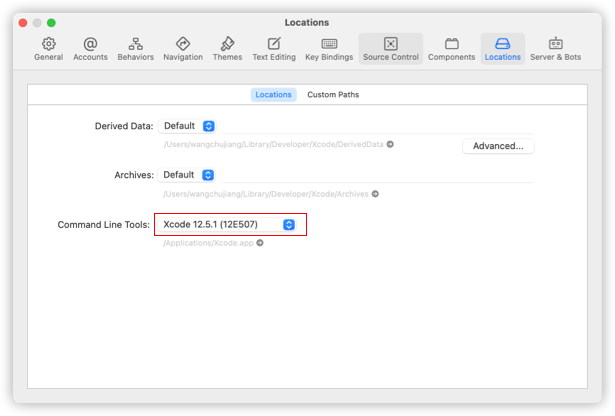
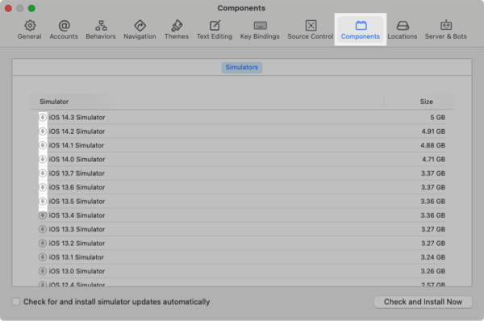
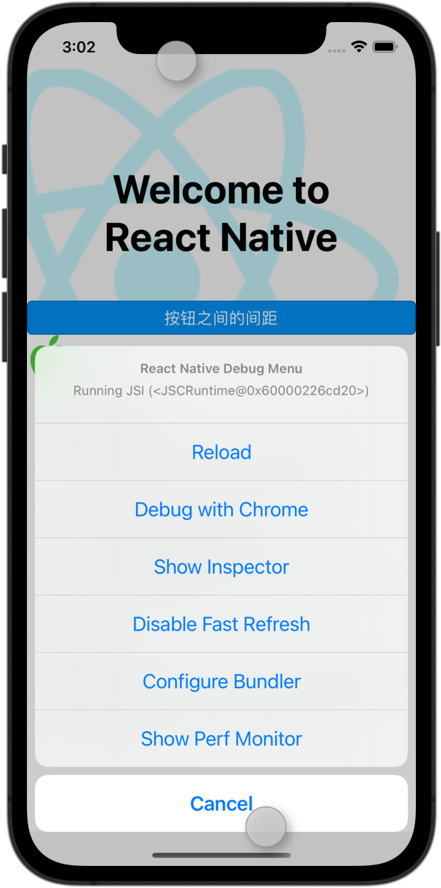

iOS 环境安装
---

这里介绍，使用 React Native CLI 运行一个 iOS 环境下的 app。 它需要 Xcode 和 最新版本的 Node.js 才能开始。 如果您已经安装了这些工具之一，您应该能够在几分钟内启动并运行。 如果未安装它们，您应该花费大约一个小时来安装和配置它们。


## 安装依赖

您将需要 [Node](https://nodejs.org)、[Watchman](https://facebook.github.io/watchman)、[React Native](https://github.com/react-native-community/cli) 命令行界面、[Xcode](https://itunes.apple.com/cn/app/xcode/id497799835?mt=12) 和 [CocoaPods](https://cocoapods.org/)。

虽然您可以使用您选择的任何编辑器来开发您的应用程序，但您需要安装 Xcode 以设置必要的工具来构建适用于 iOS 的 React Native 应用程序。

### `Node & Watchman`

我们建议使用 [Homebrew](http://brew.sh/) 安装 [Node](https://nodejs.org) 和 [Watchman](https://facebook.github.io/watchman)。 安装 [Homebrew](http://brew.sh/) 后，在终端中运行以下命令：

```shell
brew install node
brew install watchman
```

如果您的系统上已经安装了 Node，请确保它是 Node 12 或更新版本。

[Watchman](https://facebook.github.io/watchman) 是 Facebook 的一个工具，用于观察文件系统中的变化。 强烈建议您安装它以获得更好的性能。

### `Xcode`

安装 Xcode 的最简单方法是通过 [Mac App Store](https://itunes.apple.com/cn/app/xcode/id497799835?mt=12)。 安装 Xcode 也将安装 iOS 模拟器和所有必要的工具来构建你的 iOS 应用程序。

如果您已经在系统上安装了 Xcode，请确保它是 10 版或更新版本。




### `在 Xcode 中安装 iOS 模拟器`

要安装模拟器，请打开 `Xcode` > `Preferences...` 并选择 `Components` 选项卡。 选择您要使用的 iOS 相应版本的模拟器。



### `CocoaPods`

[CocoaPods](https://cocoapods.org/) 是用 Ruby 构建的，并且可以使用 macOS 上可用的默认 Ruby 进行安装。 您可以使用 Ruby 版本管理器，但我们建议您使用 macOS 上可用的标准 Ruby，除非您知道自己在做什么。

> 目前 react-native@0.64 需要 `pod v1.10.0+`<!--rehype:style=color: #0ab100;--> 以上的版本，可以在 `ios/Podfile`<!--rehype:style=color: #e00000;--> 中确定使用那个版本的 `pod`。
<!--rehype:style=border-left: 8px solid #ffe564;background-color: #ffe56440;padding: 12px 16px;-->

使用默认的 Ruby 安装将要求您在安装 gems 时使用 `sudo`。（不过，这只是 gem 安装期间的问题。）

```shell
sudo gem install cocoapods
# 要更新 CocoaPods，您只需再次安装 gem
sudo gem install cocoapods
# 更新 CocoaPods 到最新版本
sudo gem install cocoapods --pre
sudo gem install -n /usr/local/bin cocoapods --pre
# 安装指定 cocoapods 版本
sudo gem install cocoapods -v 1.4.0
```

有关更多信息，请访问 [CocoaPods 入门指南](https://guides.cocoapods.org/using/getting-started.html)。

### React Native 命令行界面

React Native 有一个内置的命令行界面。 我们建议您在运行时使用 Node.js 附带的 `npx` 访问当前版本，而不是全局安装和管理特定版本的 CLI。 使用 `npx react-native <command>`，当前稳定版本的 CLI 将在命令运行时下载并执行。

> 使用 npx（推荐），自 react-native@0.60 起可用。
<!--rehype:style=border-left: 8px solid #ffe564;background-color: #ffe56440;padding: 12px 16px;-->

## 创建一个新的应用程序

> ⚠️ 如果您之前安装了全局 `react-native-cli` 包，请将其删除，因为它可能会导致意外问题。
<!--rehype:style=border-left: 8px solid #ffe564;background-color: #ffe56440;padding: 12px 16px;-->

您可以使用 React Native 的内置命令行界面来生成一个新项目。 让我们创建一个名为 `AwesomeProject` 的新 React Native 项目：

```shell
npx react-native init AwesomeProject
```

如果您将 React Native 集成到现有应用程序中，如果您从 Expo 中 `ejected`，或者您正在向现有 React Native 项目添加 iOS 支持（请参阅[与现有应用程序集成](https://reactnative.dev/docs/integration-with-existing-apps)），则不需要这样做。 您还可以使用第三方 CLI 来初始化您的 React Native 应用程序，例如 [Ignite CLI](https://github.com/infinitered/ignite)。

### `使用特定版本或模板`

如果你想用特定的 React Native 版本开始一个新项目，你可以使用 `--version` 参数：

```bash
npx react-native init AwesomeProject --version X.XX.X
```

您还可以使用自定义 React Native 模板（如 TypeScript）使用 `--template` 参数启动项目：

```bash
npx react-native init AwesomeTSProject --template react-native-template-typescript
```

您还可以使用我们制定的模版([`@uiw/react-native-template`](https://github.com/uiwjs/react-native-template))创建一个新项目：

<!--rehype:style=background-color: rgb(118 247 149);-->
```shell
npx react-native init AwesomeProject --template @uiw/react-native-template
```

> ⚠️ 注意：如果上述命令失败，您可能在您的 PC 上全局安装了旧版本的 react-native 或 react-native-cli。 尝试卸载 `cli` 并使用 `npx` 运行 cli。
<!--rehype:style=border-left: 8px solid #ffe564;background-color: #ffe56440;padding: 12px 16px;-->

## 运行你的 React Native 应用程序

### `第 1 步：启动 Metro`

首先，您需要启动 `Metro`，这是 `React Native` 附带的 `JavaScript` 打包器。 Metro “接收一个入口文件和各种选项，并返回一个包含所有代码及其依赖项的 JavaScript 文件。” —— [Metro Docs](https://facebook.github.io/metro/docs/concepts)

要启动 Metro，请在 React Native 项目文件夹中运行 `npx react-native start` ：

```shell
npx react-native start
```

`react-native start` 启动 Metro Bundler。

> 如果您使用 `Yarn` 包管理器，则在现有项目中运行 React Native 命令时，您可以使用 `yarn` 而不是 `npx`。
<!--rehype:style=border-left: 8px solid #ffe564;background-color: #ffe56440;padding: 12px 16px;-->

> 如果您熟悉 `Web` 开发，`Metro` 很像 `webpack` —— 用于 React Native 应用程序。 与 `Kotlin` 或 `Java` 不同，`JavaScript` 不会被编译，React Native 也不会。 Bundling 与编译不同，但它可以帮助提高启动性能并将一些特定于平台的 `JavaScript` 转换为更广泛支持的 `JavaScript`。
<!--rehype:style=border-left: 8px solid #ffe564;background-color: #ffe56440;padding: 12px 16px;-->

### `第 2 步：启动您的应用程序`

让 Metro Bundler 在自己的终端中运行。 在 React Native 项目文件夹中打开一个新终端。 运行以下命令：

```bash
npx react-native run-ios
```

您应该很快就会看到您的新应用程序在 iOS 模拟器中运行。


`npx react-native run-ios` 是运行应用程序的一种方式。 您也可以直接从 Xcode 中运行它。

如果您无法使其正常工作，请参阅[故障排除页面](https://reactnative.dev/docs/troubleshooting#content)。

## 在设备上运行

默认情况下，上述命令将自动在 `iOS` 模拟器上运行您的应用程序。 如果您想在实际的物理 `iOS` 设备上运行该应用程序，请按照此处的说明进行操作。

## 修改你的应用

现在您已成功运行该应用程序，让我们对其进行修改。

在您选择的文本编辑器中打开 `App.js` 并编辑一些行。

在您的 `iOS` 模拟器中点击 `⌘R`<!--rehype:style=color: red;background: #ffd2d2;--> 以重新加载应用程序并查看您的更改！



您还可以在 `iOS` 模拟器中使用 `⌘D`<!--rehype:style=color: red;background: #ffd2d2;--> 或者 `DD`<!--rehype:style=color: red;background: #ffd2d2;--> 调出 `Debug` 菜单。如果在真机调试请 `摇一摇`<!--rehype:style=color: red;background: #ffd2d2;--> 手机调出菜单。

## 恭喜！

恭喜！ 您已经成功运行并修改了您的第一个 React Native 应用程序。
