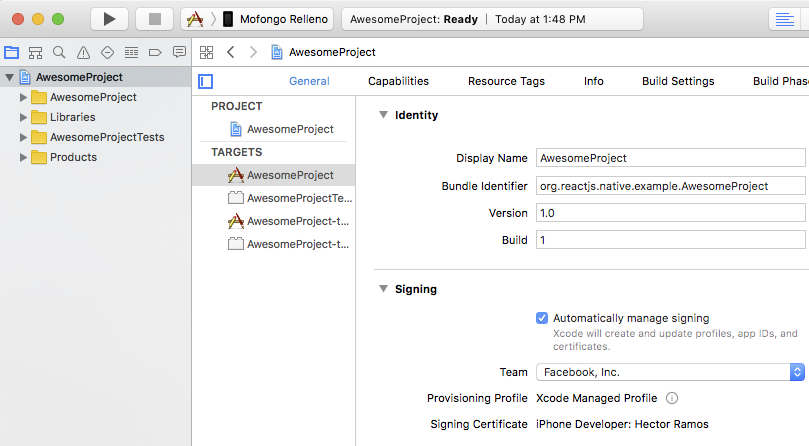
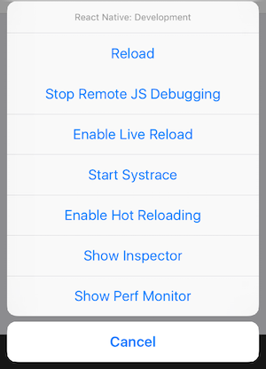
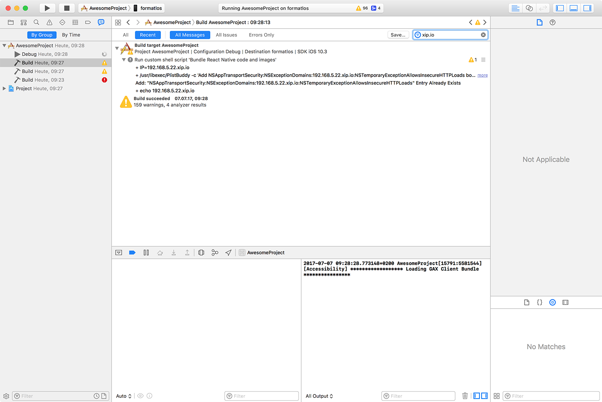

iOS 真机运行
===

本文档将指导你通过必须的步骤在设备上运行 React Native app，为生产做准备。

## 在 iOS 设备上运行应用

### `1. 通过 USB 数据线连接设备`

使用 USB 闪电数据线连接 iOS 设备到 Mac。导航到工程的`ios`文件夹，然后用 Xcode 打开`.xcworkspace`文件，如果是 0.60 以前的版本则打开`.xcodeproj`文件。

如果这是第一次在 iOS 设备上运行 app，需要注册开发设备。从 Xcode 菜单栏打开`Product`菜单，然后前往`Destination`。从列表中查找并选择设备。Xcode 将注册为开发设备。

### `2. 配置代码签名`

如果没有[Apple developer account](https://developer.apple.com/)，先注册。

在 Xcode Project 导航中选择 `project`，然后选择 `main target`（它应该和 project 共享同样的名字）。查找`"General"`标签。前往`"Signing"`并确保在`"Team"`下拉下选择了开发者账号或团队。`tests target`（以 Tests 结尾，在 main target 下面）也需要重复同样的操作。

<!--rehype:style=max-width: 480px;-->

### `3. 编译并运行应用`

如果一切设置正确，设备会在 Xcode toolbar 中被列为 `build target`，也会出现在设备面板里(`⇧⌘2`<!--rehype:style=color: red;background: #ffd2d2;-->)。现在可以按下 `Build and run` 按钮(`⌘R`<!--rehype:style=color: red;background: #ffd2d2;-->)或从`Product`菜单中选择`Run`。app 会立刻启动在设备上。

<!--rehype:style=max-width: 480px;-->

> 🚧 注意：如果您遇到任何问题，请查看Apple的“[Launching Your App on a Device](https://help.apple.com/xcode/mac/current/#/dev60b6fbbc7)”文档。
<!--rehype:style=border-left: 8px solid #ffe564;background-color: #ffe56440;padding: 12px 16px;-->

## 从设备上访问开发服务器

在启用开发服务器的情况下，你可以快速的迭代修改应用，然后在设备上立即查看结果。只需要在和电脑`同样的 Wi-Fi 网络`<!--rehype:style=color: red;background: #ffd2d2;-->。摇晃设备打开[Developer menu](https://reactnative.cn/docs/debugging#accessing-the-in-app-developer-menu)，然后 `enable Live Reload`。当 JavaScript 代码改变时 app 会重载。

<!--rehype:style=max-width: 480px;-->

## 常见问题

> 🚧 注意：如果您有任何问题，请确保您的Mac和设备位于同一网络上，并且可以相互连接。许多具有捕获入口的开放式无线网络被配置为防止设备到达网络上的其他设备。在这种情况下，您可以使用设备的个人热点功能。
<!--rehype:style=border-left: 8px solid #ffe564;background-color: #ffe56440;padding: 12px 16px;-->

当尝试连接到开发服务器时，可能得到一个红屏报错说：

> 🚧 注意：Connection to `http://localhost:8081/debugger-proxy?role=client` timed out. Are you running node proxy? If you are running on the device, check if you have the right IP address in RCTWebSocketExecutor.m.
<!--rehype:style=border-left: 8px solid #ffe564;background-color: #ffe56440;padding: 12px 16px;-->

解决这个问题检查以下几点。

### `1. Wi-Fi 网络`

确保笔记本电脑和电话在`同一个`<!--rehype:style=color: red;background: #ffd2d2;-->Wi-Fi 网络。   

### `2. IP 地址`

确保编译脚本正确检测到机器的 IP 地址(`e.g. 10.0.1.123`)。

打开`Report navigator`标签，选择最近的`Build`然后搜索`IP=`。搜索到的 `IP` 地址字符串应该和你电脑的 `IP` 地址一致。

## 开发模式弹出开发者菜单刷新应用

命令行支持*打开开发者菜单*，和其它的一些操作

1. `r` - 重新加载应用
2. `d` - 打开开发者菜单
3. `i` - 在 iOS 上运行
4. `a` - 在 Android 上运行

#### iOS

使用 <kbd>⌘</kbd><kbd>R</kbd> 让您的 IOS 模拟器重新加载本地项目，使用 <kbd>⌘</kbd><kbd>T</kbd> 弹出开发者菜单。

## 恭喜

恭喜！您已经用 React Native 编译了一个伟大的 app