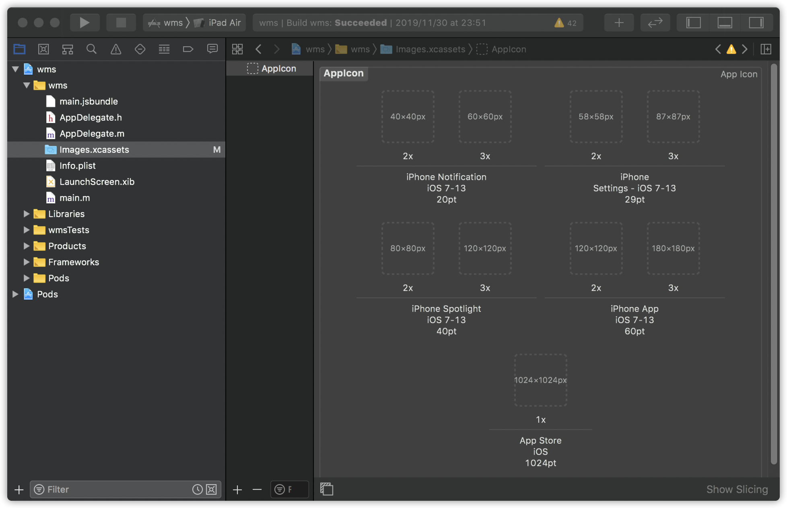
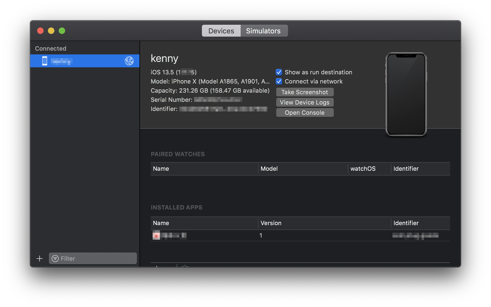
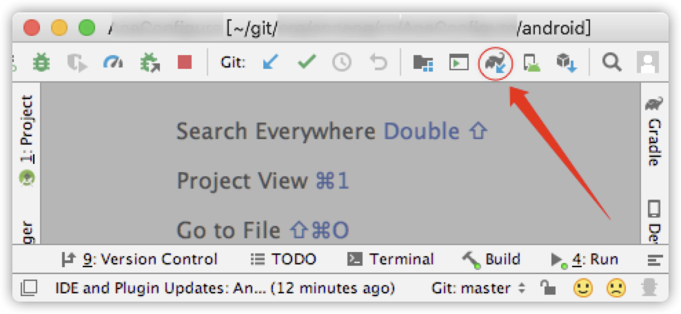
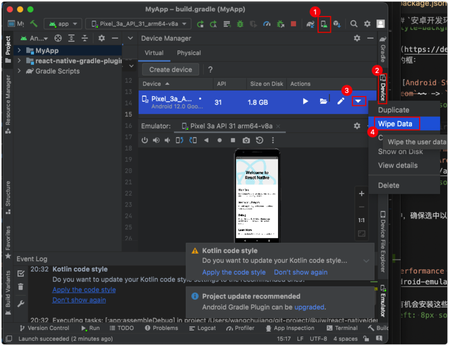
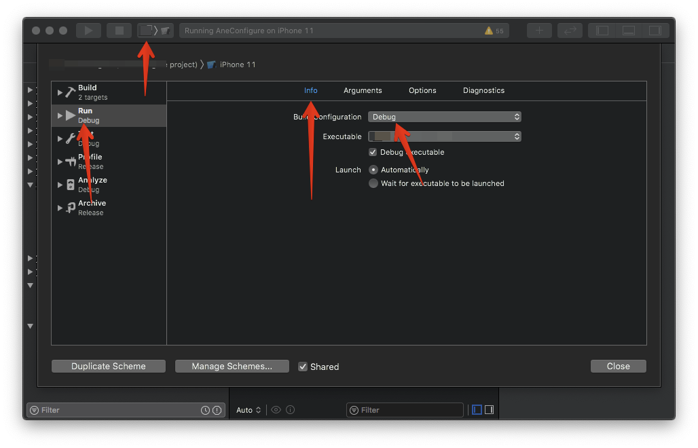
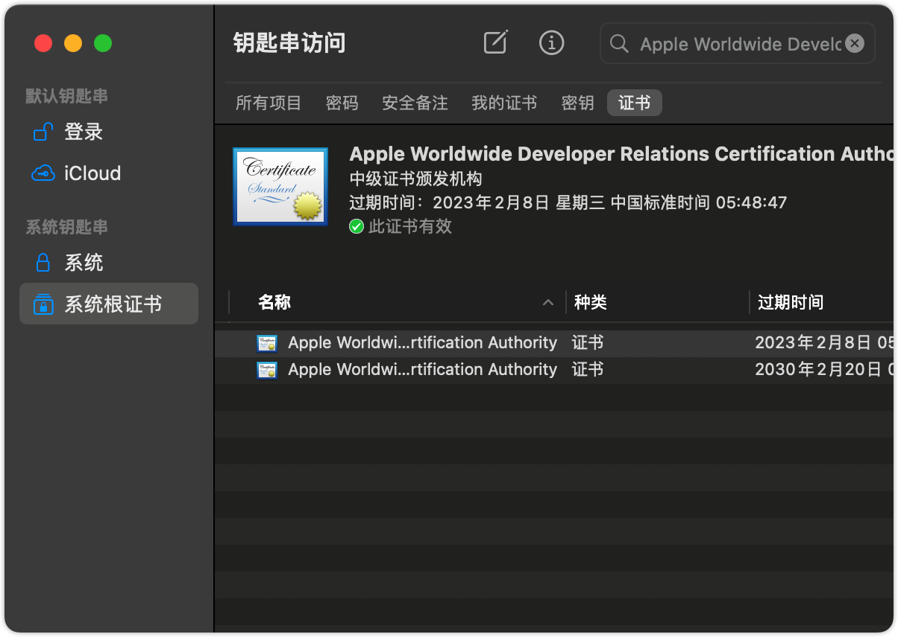
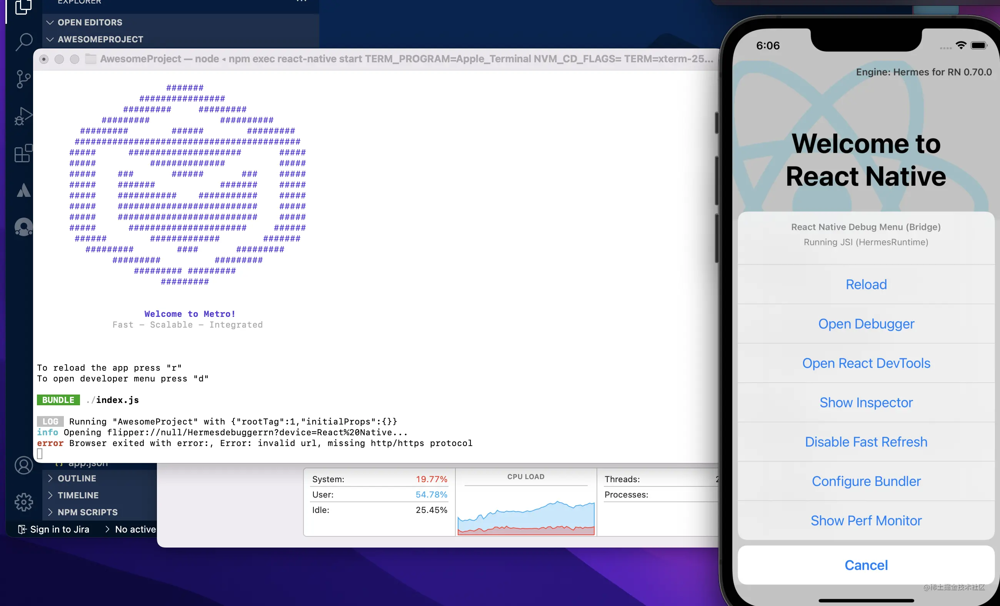

<!--idoc:ignore:start-->
React Native
===
<!--idoc:ignore:end-->

一些 React Native 开发上遇到的问题简单记录。

## 1.修改 App 在手机上展示的名称

#### Android

修改 `android/app/src/main/res/values/strings.xml` 配置

```xml
<resources>
  <string name="app_name">这里填写名称</string>
</resources>
```

#### iOS

修改 `ios/<应用名称>/Info.plist` 配置

```xml
<key>CFBundleDisplayName</key>
<string>这里填写名称</string>
```

## 2.修改 App 在手机上展示的图标

#### Android

修改替换 `android/app/src/main/res/mipmap-(*)` 下面的图标

图标分为 方形图标(`ic_launcher.png`) 和 圆形图标(`ic_launcher_round.png`)

#### iOS

修改 `ios/<应用名称>/Images.xcassets/AppIcon.appiconset/Contents.json` 配置，及修改配置目录 `ios/<应用名称>/Images.xcassets/AppIcon.appiconset` 下的图标文件。

通过 xcode 下图拖拽更换图标更方便。

<!--rehype:style=max-width: 650px;width: 100%;-->

## 3.判断 Release/Debug 用于调试

#### Android

修改 `android/app/src/main/res/values/strings.xml` 配置

```java
// 在Android Studio项目中
if(BuildConfig.DEBUG){
  // debug模式
}else{
  // release模式
}
```

#### iOS

```objective-c
#ifdef DEBUG
   // debug模式
#else
    //release 模式
#endif
```

#### React Native

```js
if (__DEV__) {
  // debug 模式
} else {
  // release 模式
}
```

## 4.开发模式弹出开发者菜单刷新应用

命令行支持*打开开发者菜单*，和其它的一些操作

1. `r` - 重新加载应用
2. `d` - 打开开发者菜单
3. `i` - 在 iOS 上运行
4. `a` - 在 Android 上运行


#### Android

按两次 <kbd>R</kbd> 键或从开发者菜单(<kbd>⌘</kbd><kbd>M</kbd>)中选择重新加载(Reload)以预览您的更改。

> 如果没有起作用可以在命令行使用 `adb shell input keyevent 82` 命令唤起**开发者菜单**

#### iOS

使用 <kbd>⌘</kbd><kbd>R</kbd> 让您的 IOS 模拟器重新加载本地项目，使用 <kbd>⌘</kbd><kbd>T</kbd> 弹出开发者菜单。

## 5.设置允许 HTTP 请求访问

#### Android

创建配置文件 `android/app/src/main/res/xml/network_security_config.xml` 内容如下：

```xml
<?xml version="1.0" encoding="utf-8"?>
<network-security-config>
    <base-config cleartextTrafficPermitted="true" />
</network-security-config>
```

修改配置 `android/app/src/main/AndroidManifest.xml`

```diff
<application
  android:name=".MainApplication"
  android:label="@string/app_name"
  android:icon="@mipmap/ic_launcher"
  android:roundIcon="@mipmap/ic_launcher_round"
  android:allowBackup="false"
+  android:networkSecurityConfig="@xml/network_security_config"
  android:theme="@style/AppTheme">
</application>
```

#### iOS

修改 `ios/<应用名称>/Info.plist` 配置

```xml
<key>NSAppTransportSecurity</key>
<dict>
  <key>NSAllowsArbitraryLoads</key>
  <true/>
</dict>
```

## 6.真机配置 IP 调试

#### 配置说明

1. ⚠️ 首先保证真机和 pc 在同一个局域网络下。
2. 摇晃你的实体真机，调出配置弹窗。
3. 团队开发可以不安装开发环境。

**`摇晃手机`** => `Configure Bundler` => 设置 `ip:端口`

默认端口：`8081` 可以通过参数更改默认端口 `react-native start --port 9999`

#### Android 设置


#### iOS 设置

设置 `Build Configuration` 为 `Debug` 模式连接真机打包 APP。  

> `Xcode` => `Product` => `Scheme` => `Edit Scheme...` => `Run` => `Info` => `Build Configuration` => `Debug`

## 7.Xcode 不用数据线真机调试

通过菜单 `Xcode` => `Product` => `Destination` => `Add Additional Simulators...` 打开设置界面，勾选 `Connect via network`。

<!--rehype:style=max-width: 650px;width: 100%;-->

如果是第一次操作， 可能会需要先进行配对操作；

1. 可在以上面弹出的界面中，点击左侧的设备，然后右健选`unpair device`。
2. 然后再去勾选 `connect via network`；
3. 这时手机上会提示信任界面，点击确认即可。

## 8.打包修改 APP 版本号

#### Android

修改 `android/app/build.gradle` 配置

```java
android {
  .....
  defaultConfig {
    ....
    versionName "2.1.1"
  }
}
```

#### iOS

修改 `ios/<应用名称>/Info.plist` 配置

```xml
<key>CFBundleShortVersionString</key>
<string>1.2.0</string>
```

## 9.常见错误

### 应用反应缓慢，出现卡顿问题

#### 可能存在的问题

- 查看是否 console 日志打印过度造成。
- React Native Debugger 页面放到最前面，浏览器窗口不要放到选项卡里面。

### Android: Gradle project sync failed.

#### 问题解决方法

在 Android Gradle 同步失败，导致项目无法启动，只需重新同步 Gradle 即可(可能需要翻墙)，方法如下图。

<!--rehype:style=max-width: 650px;width: 100%;-->

### Android: The device needs more free storage to install the application

#### 问题解决方法

<!--rehype:style=max-width: 650px;width: 100%;-->

### Android: Cannot convert string value 'UNIFIED_TEST_PLATFORM'

```bash
convert string value 'UNIFIED_TEST_PLATFORM' to an enum value of type 'com.android.builder.model.AndroidGradlePluginProjectFlags$BooleanFlag' (valid case insensitive values: APPLICATION_R_CLASS_CONSTANT_IDS, TEST_R_CLASS_CONSTANT_IDS, TRANSITIVE_R_CLASS, JETPACK_COMPOSE, ML_MODEL_BINDING)
```

#### 问题解决方法

你需要下载最新版 [`android-studio-2021.2.1.16-mac_arm.dmg`](https://developer.android.google.cn/studio/archive) 。

### iOS: library not found for -lDoubleConversion.

#### 问题解决方法

Xcode 打开工程文件错误，使用 `*.xcodeproj` 打开工程会报这个错误。

> 请打开 `*.xcworkspace` 的工程文件，错误将得到解决。

### iOS: symbol(s) not found for architecture i386.

#### 问题解决方法

可能使用的某个包，不支持 i386 模拟器，使用 x86 模拟器或真机。

> 设置 `Build Configuration` 为 `Debug` 模式下可能会解决问题。  
> `Xcode` => `Product` => `Scheme` => `Edit Scheme...` => `Run` => `Info` => `Build Configuration`  

<!--rehype:style=max-width: 650px;width: 100%;-->

### iOS: Command PhaseScriptExecution failed with a nonzero exit code

> React-Core-AccessibilityResources Command CodeSign failed with a nonzero exit code

#### 问题解决方法

打开 `Kaychain Access(钥匙串访问)` 应用删除 `Apple Worldwide Developer Relations Certification Authority` 证书

<!--rehype:style=max-width: 650px;width: 100%;-->

## 10.React Native 0.70 版本，在iOS模拟器中Open Debugger无法启动

#### `版本:`

```
"react": "18.1.0",
"react-native": "0.70.1",
```

#### `问题`

`Cmd+D > Open Debugger > console logs`:

```
info Opening flipper://null/Hermesdebuggerrn?device=React%20Native...
error Browser exited with error:, Error: invalid url, missing http/https protocol
```
<!--rehype:style=max-width: 650px;width: 100%;-->

### `解决方案一`

1. 搜索关键字:`hermes_enabled`，`true改为false` `:hermes_enabled => false`<!--rehype:style=color: red;background: #ffd2d2;-->
2. 移除Hermes引擎 `cd ios && pod install && cd ..`
3. 重启项目 `yarn run ios`

### `解决方案二`

RN版本使用0.69.0


## 11.React Native 0.70.0 ios fresh project errors out on run-ios
请保证你的ruby版本为`2.7.5`<!--rehype:style=color: red;background: #ffd2d2;-->或`更高版本`<!--rehype:style=color: red;background: #ffd2d2;-->,你可以使用 [rbenv](https://github.com/rbenv/rbenv#readme) 或 [RVM ](https://www.ruby-lang.org/en/documentation/installation/#rvm) 来管理你的ruby版本

#### 1.`安装 rbenv`
```
$ brew install rbenv ruby-build # macOS
# Debian、ubuntu 和其他衍生产品
$ sudo apt install rbenv
```

#### 2.`管理 ruby版本`
```
# 列出最新的稳定版本
$ rbenv install -l
# 列出所有本地版本
$ rbenv install -L
# 安装 Ruby 版本
$ rbenv install 3.1.2
$ rbenv global 3.1.2 # 为这台机器设置默认Ruby版本
# 或者
$ rbenv local 3.1.2 # 设置此目录的 Ruby 版本
$ rbenv local --unset
$ rbenv version # 显示当前活动的 Ruby 版本
=> 1.9.3-p327 (set by /Users/sam/.rbenv/version)
```

#### 3.`在项目中，输入以下命令`
```
bundle install
cd ios && bundle exec pod install
```

## 12.MacBook Pro with a M1

```bash
# Install ffi
sudo arch -x86_64 gem install ffi

rm -rf Pods Podfile.lock

# Clear pods.
pod deintegrate
# pod rm Podfile.lock
arch -x86_64 pod install
# Re-install pods
arch -x86_64 pod install --repo-update --verbose

yarn run ios # Run instructions for iOS
```