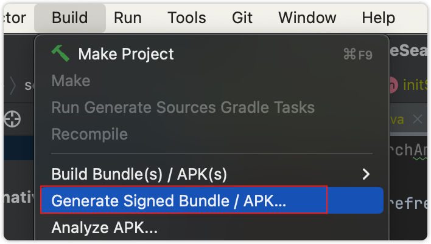
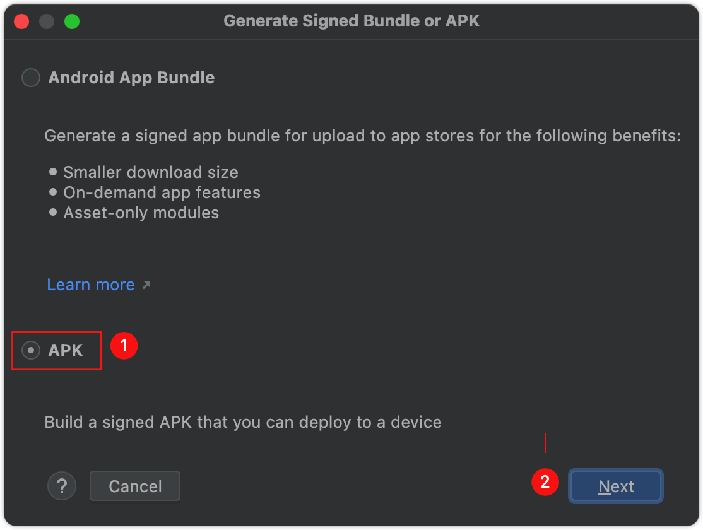
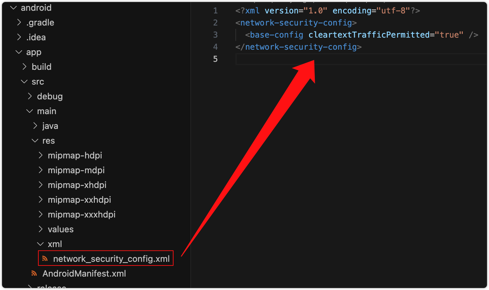

Android 打包
===
官方教程 https://reactnative.dev/docs/signed-apk-android/

Android要求所有应用都必须先使用证书进行数字签名，然后才能安装。 为了通过Google Play商店分发您的Android应用，需要使用发布密钥对其进行签名，然后再将其用于以后的所有更新。 自2017年以来，借助Google Play的应用签名功能，Google Play可以自动管理签名发布。 但是，在将应用程序二进制文件上传到Google Play之前，需要使用上传密钥对其进行签名。 Android Developers文档上的[“签署应用程序”](https://developer.android.com/tools/publishing/app-signing.html)页面详细描述了该主题。 本指南简要介绍了该过程，并列出了打包JavaScript捆绑包所需的步骤。

## 生成上传需要的秘钥

> Android要求所有应用都有一个数字签名才会被允许安装在用户手机上，Android开发者官网上的如何给你的 [应用签名文档](https://developer.android.com/tools/publishing/app-signing.html) 描述了签名的细节  

生成签名有两种方式：

- Keytool命令行
- Android Studio界面生成

# Android Studio界面生成
## 一. 创建签名文件

### `创建签名文件`<!--rehype:style=color: white; background: #1c7bd0;-->

用 `Android Studio`<!--rehype:style=color: #1c7bd0; background: ##E6E6E6-->打开需要打包的项目,之后选择 `Build`<!--rehype:style=color: #1c7bd0; background: ##E6E6E6-->中的`Generate Signed Bundle/APK`<!--rehype:style=color: #1c7bd0; background: ##E6E6E6-->开始创建签名文件。

<!--rehype:style=max-width: 650px;width: 100%;-->

选择`Android App Bundle`<!--rehype:style=color: #1c7bd0; background: ##E6E6E6-->点击进入下一步。

<!--rehype:style=max-width: 650px;width: 100%;-->

### `填写签名参数`<!--rehype:style=color: white; background: #1c7bd0;-->

<!--rehype:style=max-width: 650px;width: 100%;-->

#### `1. 创建密钥库(已拥有密钥库跳过)`<!--rehype:style=color: white; background: #ffb703;-->

点击`Create new...”`<!--rehype:style=color: #1c7bd0; background: ##E6E6E6-->按钮创建密钥库，填写相关信息后，点击`OK`创建成功。

<!--rehype:style=max-width: 650px;width: 100%;-->

#### `2.选择已存在密钥库及密钥`<!--rehype:style=color: white; background: #ffb703;-->

点击`Choose existing...”`<!--rehype:style=color: #1c7bd0; background: ##E6E6E6-->按钮找到密钥库文件。

<!--rehype:style=max-width: 650px;width: 100%;-->

> 密钥库文件地址在项目`Android/app/debug.keystore`<!--rehype:style=color: #1c7bd0; background: ##E6E6E6-->目录下。
<!--rehype:style=border-left: 8px solid #ffe564;background-color: #ffe56440;padding: 12px 16px;-->

# Keytool命令行生成
您可以使用keytool生成专用签名密钥。 在Windows上，必须从 `C:\Program Files\Java\jdkx.x.x_x\bin` 运行keytool。

```shell
$ keytool -genkeypair -v -keystore xx-key.keystore -alias xx-key-alias -keyalg RSA -keysize 2048 -validity 10000
```

⚠️  生成打包用的 key，将 `keystore` 命名为 `xx-release-key.keystore` 别名 `-alias` 为 `xx-key-alias`  
⚠️  记住要输入的 `输入密钥库口令:`

```shell
keytool -genkeypair -v -keystore xx-release-key.keystore -alias xx-key-alias -keyalg RSA -keysize 2048 -validity 10000
# 输入密钥库口令: 123456
# 再次输入新口令:
# 您的名字与姓氏是什么?
#   [Unknown]:  Wang
# 您的组织单位名称是什么?
#   [Unknown]:  junzhuo
# 您的组织名称是什么?
#   [Unknown]:  junzhuo
# 您所在的城市或区域名称是什么?
#   [Unknown]:  shanghai
# 您所在的省/市/自治区名称是什么?
#   [Unknown]:  shanghai
# 该单位的双字母国家/地区代码是什么?
#   [Unknown]:  zh
# CN=Wang, OU=junzhuo, O=junzhuo, L=shanghai, ST=shanghai, C=zh是否正确?
#   [否]:  y
#
# 正在为以下对象生成 2,048 位RSA密钥对和自签名证书 (SHA256withRSA) (有效期为 10,000 天):
#    CN=Wang, OU=junzhuo, O=junzhuo, L=shanghai, ST=shanghai, C=zh
# 输入 <xx-key-alias> 的密钥口令
#   (如果和密钥库口令相同, 按回车):
# [正在存储goods-key.keystore]
#
# 这是一个巨坑 不要迁移标准格式，否则打包错误
# Warning:
# JKS 密钥库使用专用格式。建议使用 "keytool -importkeystore -srckeystore xx-key.keystore -destkeystore xx-key.keystore -deststoretype pkcs12" 迁移到行业标准格式 PKCS12。
```

⚠️⚠️⚠️ 下面这是一个巨坑 不要迁移标准格式，否则打包错误，上面生成命令会提示下面命令，如果你照做了，坑可能爬不出来

```shell
# Warning:
# JKS 密钥库使用专用格式。建议使用 "
keytool -importkeystore -srckeystore xx-key.keystore -destkeystore xx-key.keystore -deststoretype pkcs12
# " 迁移到行业标准格式 PKCS12。
```

## 设置Gradle变量
<!--rehype:style=max-width: 650px;width: 100%;-->

如果 Gradle 加载失败，https://gradle.org/ 点击下面按钮重新同步

<!--rehype:style=max-width: 650px;width: 100%;-->

Android Studio 打包

<!--rehype:style=max-width: 650px;width: 100%;-->

<!--rehype:style=max-width: 650px;width: 100%;-->

<!--rehype:style=max-width: 650px;width: 100%;-->

记得选择生成目录 `<项目所在目录>/android/app/build/outputs/apk`

<!--rehype:style=max-width: 650px;width: 100%;-->

## react-native android9.0以上打包APK后HTTP请求不到解决方法

错误原因：android9.0默认禁止访问不安全的请求，比如http。

### 解决方案：
方法1：  使用认证过的https（我用的是阿里云免费证书，因为使用https还得配置，所以用了http）

方法2： 分为两步

第一步：在res下新增加一个xml目录，然后创建一个名为network_security_config.xml文件

<!--rehype:style=max-width: 650px;width: 100%;-->

```bash
<?xml version="1.0" encoding="utf-8"?>
<network-security-config>
    <base-config cleartextTrafficPermitted="true" />
</network-security-config>
```

第二步：

  在androidManifiest.xml文件中添加
```bash
android:networkSecurityConfig="@xml/network_security_config"
```
<!--rehype:style=max-width: 650px;width: 100%;-->

> ⚠️ 下面还有一种方式 本质上跟第二种方法一样，简便但不规范  建议用上面的方法<!--rehype:style=background: #F08800; color: #fff;-->
<!--rehype:style=border-left: 8px solid #ffe564;background-color: #ffe56440;padding: 12px 16px;-->

在项目/android/app/src/main/AndroidManifest.xml文件中的application节点下添加

```bash
android:usesCleartextTraffic="true"
```

<!--rehype:style=max-width: 650px;width: 100%;-->