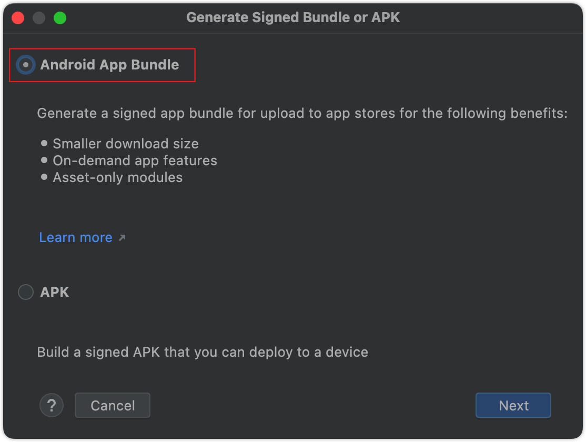

Android(Mac) 打包
===

> 🚧 Android(Mac)打包前需要先准备好`需要打包的项目`<!--rehype:style=color: #1c7bd0; background: ##E6E6E6--> 及 `Android Studio`<!--rehype:style=color: #1c7bd0; background: ##E6E6E6-->。
<!--rehype:style=border-left: 8px solid #ffe564;background-color: #ffe56440;padding: 12px 16px;-->

## 一. 创建签名文件

### `创建签名文件`<!--rehype:style=color: white; background: #1c7bd0;-->

用 `Android Studio`<!--rehype:style=color: #1c7bd0; background: ##E6E6E6-->打开需要打包的项目,之后选择 `Build`<!--rehype:style=color: #1c7bd0; background: ##E6E6E6-->中的`Generate Signed Bundle/APK`<!--rehype:style=color: #1c7bd0; background: ##E6E6E6-->开始创建签名文件。

<!--rehype:style=max-width: 650px;width: 100%;-->

选择`Android App Bundle`<!--rehype:style=color: #1c7bd0; background: ##E6E6E6-->点击进入下一步。

<!--rehype:style=max-width: 650px;width: 100%;-->

### `填写签名参数`<!--rehype:style=color: white; background: #1c7bd0;-->

<!--rehype:style=max-width: 650px;width: 100%;-->

#### `1. 创建密钥库(已拥有密钥库跳过)`<!--rehype:style=color: white; background: #ffb703;-->

点击`Create new...”`<!--rehype:style=color: #1c7bd0; background: ##E6E6E6-->按钮创建密钥库，填写相关信息后，点击`OK`创建成功。

<!--rehype:style=max-width: 650px;width: 100%;-->

#### `2.选择已存在密钥库及密钥`<!--rehype:style=color: white; background: #ffb703;-->

点击`Choose existing...”`<!--rehype:style=color: #1c7bd0; background: ##E6E6E6-->按钮找到密钥库文件。

<!--rehype:style=max-width: 650px;width: 100%;-->

> 密钥库文件地址在项目`Android/app/debug.keystore`<!--rehype:style=color: #1c7bd0; background: ##E6E6E6-->目录下。
<!--rehype:style=border-left: 8px solid #ffe564;background-color: #ffe56440;padding: 12px 16px;-->

文档正在建设中...