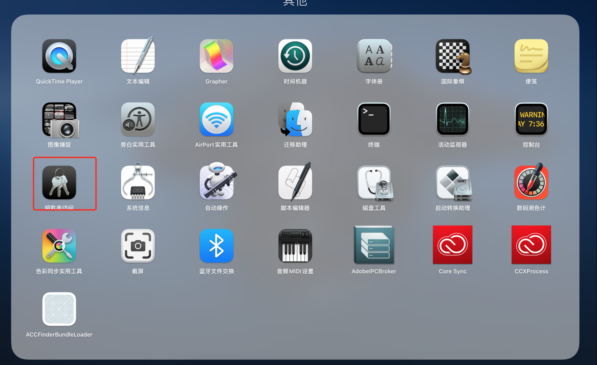
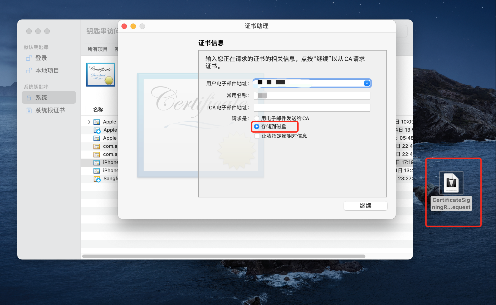

iOS 打包
===

iOS项目打包前，需要先准备 `开发者账号` 、 `需要上线的项目`及 ` mac电脑和xcode`。

## 一. 开发者账号

打包前需要有一个苹果开发者账号，要是没有，可进入[Developer苹果开发者官网](https://developer.apple.com),点击“Account”登录/注册会员。

## 二. 配置iOS证书
### `配置证书`<!--rehype:style=color: white; background: #1c7bd0;-->

登陆成功后，登录开发者账号，进入`Certificates`, `Identifiers & Profiles`，选择`Certificates`新建。

<!--rehype:style=max-width: 650px;width: 100%;-->

### `选择类型`<!--rehype:style=color: white; background: #1c7bd0;-->

<!--rehype:style=max-width: 650px;width: 100%;-->

### `选择证书文件`<!--rehype:style=color: white; background: #1c7bd0;-->

#### `无证书文件可通过钥匙串访问创建`<!--rehype:style=color: white; background: #ffb703;-->

进入启动台，点击进入钥匙串访问。

<!--rehype:style=max-width: 650px;width: 100%;-->

进入钥匙串访问，通过`证书助理`-选择`从证书颁发机构请求`申请证书。

<!--rehype:style=max-width: 650px;width: 100%;-->

本地证书生成后，回到`Certificates, Identifiers & Profiles`-`Create a New Certificate`选择该文件即可进入下一步，选择已生成的本地证书创建新的证书。

<!--rehype:style=max-width: 650px;width: 100%;-->

文档正在建设中...